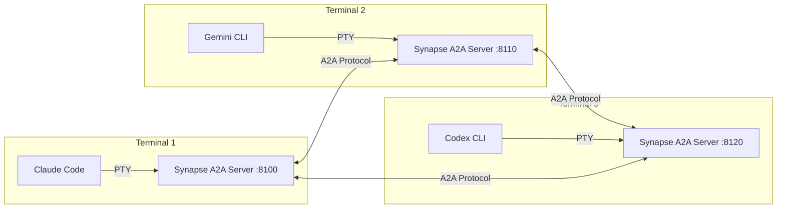

<div class="hero" markdown>

# Synapse A2A

<p class="hero-subtitle">
Enable CLI agents to collaborate without changing their behavior
</p>

<div class="hero-buttons">
<a href="getting-started/installation/" class="primary">Get Started</a>
<a href="concepts/architecture/" class="secondary">Learn More</a>
</div>

</div>

---

## What is Synapse A2A?

Synapse A2A is a framework that wraps CLI agents (**Claude Code**, **Codex**, **Gemini**, **OpenCode**, **GitHub Copilot CLI**) with PTY and enables inter-agent communication via the [Google A2A Protocol](https://developers.googleblog.com/en/a2a-a-new-era-of-agent-interoperability/). Each agent runs as an A2A server in a **peer-to-peer architecture** — no central server required.



## Core Principles

<div class="feature-grid" markdown>

<div class="feature-card" markdown>
<div class="feature-icon" markdown>:material-shield-outline:</div>

### Non-Invasive

Wraps agents transparently via PTY without modifying their behavior. Your existing workflow stays the same.
</div>

<div class="feature-card" markdown>
<div class="feature-icon" markdown>:material-connection:</div>

### A2A Protocol First

All communication uses the Google A2A standard — `Message/Part + Task` format, standard endpoints, protocol compliance.
</div>

<div class="feature-card" markdown>
<div class="feature-icon" markdown>:material-account-group:</div>

### Peer-to-Peer

No central server. Every agent is an equal peer that can send, receive, and coordinate with any other agent.
</div>

<div class="feature-card" markdown>
<div class="feature-icon" markdown>:material-eye-off-outline:</div>

### Agent Ignorance

Agents don't need to know about collaboration details. Synapse handles routing, reply tracking, and transport.
</div>

</div>

## Key Features

<div class="feature-grid" markdown>

<div class="feature-card" markdown>
<div class="feature-icon" markdown>:material-message-arrow-right:</div>

### Inter-Agent Communication
Send messages between agents with priority levels, roundtrip replies, broadcast, and soft interrupts.

```bash
synapse send gemini "Review this code" --wait
```
</div>

<div class="feature-card" markdown>
<div class="feature-icon" markdown>:material-monitor-multiple:</div>

### Agent Teams
Spawn multi-agent teams with auto-pane creation, delegate mode for managers, and worktree isolation.

```bash
synapse team start claude gemini codex \
  --layout split
```
</div>

<div class="feature-card" markdown>
<div class="feature-icon" markdown>:material-account-cog-outline:</div>

### Agent Management
Orchestrate work with the `synapse-manager` skill. 5-step workflow: Delegate, Monitor, Verify, Feedback, Review.

```bash
synapse spawn claude --name Impl --role "implementation"
```
</div>

<div class="feature-card" markdown>
<div class="feature-icon" markdown>:material-file-document-edit-outline:</div>

### Documentation Expert
Maintain project docs with `doc-organizer`. Audit, restructure, and synchronize documentation with code.

```bash
synapse skills deploy doc-organizer --scope project
```
</div>

<div class="feature-card" markdown>
<div class="feature-icon" markdown>:material-clipboard-check-outline:</div>

### Shared Task Board
Coordinate work with SQLite-based task tracking, dependencies, priority levels, and plan approval.

```bash
synapse tasks create "Implement auth" \
  -d "OAuth2 with JWT" --priority 4
```
</div>

<div class="feature-card" markdown>
<div class="feature-icon" markdown>:material-lock-outline:</div>

### File Safety
Prevent multi-agent file conflicts with exclusive locking, change tracking, and modification history.

```bash
synapse file-safety lock src/auth.py \
  claude --intent "Refactoring"
```
</div>

<div class="feature-card" markdown>
<div class="feature-icon" markdown>:material-puzzle-outline:</div>

### Skills System
Discover, deploy, and manage skills across scopes. Skill sets group capabilities for specialized agents.

```bash
synapse skills deploy code-review \
  --agent claude,codex --scope user
```
</div>

<div class="feature-card" markdown>
<div class="feature-icon" markdown>:material-history:</div>

### History & Tracing
Automatic task history with search, statistics, export, and cross-referencing with file modifications.

```bash
synapse trace <task_id>
```
</div>

<div class="feature-card" markdown>
<div class="feature-icon" markdown>:material-brain:</div>

### Shared Memory
Cross-agent knowledge sharing via project-local SQLite. Save, search, and broadcast learned knowledge.

```bash
synapse memory save auth-pattern \
  "Use OAuth2 with PKCE" --tags auth --notify
```
</div>

</div>

## Supported Agents

<div class="agent-badges" markdown>
<span class="agent-badge">:material-robot: Claude Code</span>
<span class="agent-badge">:material-creation: Gemini CLI</span>
<span class="agent-badge">:material-code-braces: Codex CLI</span>
<span class="agent-badge">:material-console: OpenCode</span>
<span class="agent-badge">:material-github: Copilot CLI</span>
</div>

<!-- markdownlint-disable MD046 -->
## Quick Start

=== "Install"

    ```bash
    # Using pipx (recommended)
    pipx install synapse-a2a

    # Using pip
    pip install synapse-a2a
    ```

=== "Start Agents"

    ```bash
    # Terminal 1: Start Claude
    synapse claude

    # Terminal 2: Start Gemini
    synapse gemini
    ```

=== "Communicate"

    ```bash
    # Send a message from Claude to Gemini
    synapse send gemini "Analyze this codebase" --wait

    # Monitor all agents
    synapse list
    ```

<!-- markdownlint-enable MD046 -->

---

<div style="text-align: center" markdown>
[Get Started :material-arrow-right:](getting-started/installation.md){ .md-button .md-button--primary }
[View on GitHub :material-github:](https://github.com/s-hiraoku/synapse-a2a){ .md-button }
</div>
