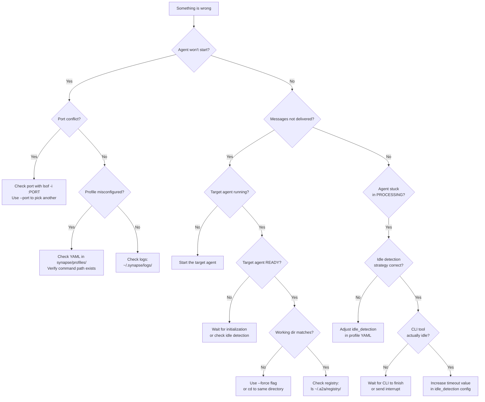

# Troubleshooting

This page covers common issues encountered when using Synapse A2A and their solutions.

---

## Diagnostic Flowchart

Use this decision tree to quickly identify the category of your issue:



---

## PTY / TUI Issues

### Screen Corruption

**Symptom**: Agent's TUI display is garbled or overlapping.

**Solutions**:

- Press ++ctrl+l++ to redraw the screen
- Restart the agent: `synapse kill <agent> && synapse <type>`
- Check terminal encoding: `locale` should show UTF-8

!!! tip "TERM environment variable"
    Make sure the `TERM` environment variable is set correctly in your profile YAML:
    ```yaml
    # synapse/profiles/claude.yaml
    env:
      TERM: "xterm-256color"
    ```

### Agent Display Not Updating

**Symptom**: `synapse list` shows stale status.

**Solutions**:

- File watcher may have failed -- press any key to force refresh
- Check if the agent process is still running: `ps aux | grep synapse`
- Restart `synapse list`

### Font Rendering Issues

**Symptom**: Icons or special characters display as boxes.

**Solution**: Install a [Nerd Font](https://www.nerdfonts.com/) and configure your terminal to use it.

### Duplicate Input Prompts

**Symptom**: The input prompt appears multiple times, making it unclear where to type.

**Cause**: This is a known issue with Ink-based TUI apps (Claude Code, Copilot CLI) where the TUI rendering occasionally duplicates prompt elements.

**Solutions**:

- Update the CLI tool to the latest version
- Restart the terminal emulator
- Try a different terminal emulator

### CJK Character Encoding

**Symptom**: Japanese, Chinese, or Korean characters display as garbled text or empty boxes.

**Solution**: Set the locale environment variables in your profile YAML:

```yaml
env:
  LANG: "en_US.UTF-8"
  LC_ALL: "en_US.UTF-8"
  TERM: "xterm-256color"
```

---

## Agent Detection Problems

### @Agent Not Found

**Symptom**: `@gemini` pattern doesn't route messages.

**Solutions**:

- Verify the target agent is running: `synapse list`
- Check working directory matches (agents in different directories cannot see each other by default)
- Use explicit `synapse send` instead of `@agent` pattern

### Agent Missing from List

**Symptom**: Agent is running but doesn't appear in `synapse list`.

**Solutions**:

- Check registry directory: `ls ~/.a2a/registry/`
- Agent may have crashed -- check logs: `synapse logs <type>`
- Stale registry entry -- restart the agent

!!! note "Registry debugging commands"
    ```bash
    # List all registry files
    ls -la ~/.a2a/registry/

    # Inspect a specific agent's registry entry
    cat ~/.a2a/registry/synapse-claude-8100.json | python -m json.tool

    # Check external agent registrations
    ls -la ~/.a2a/external/
    ```

### Stale Registry Entries

**Symptom**: Dead agents still appear in `synapse list`.

**Solution**: Dead processes are auto-cleaned on next registry read. If persistent:

```bash
# Check PID
cat ~/.a2a/registry/synapse-<type>-<port>.json | python -m json.tool

# Remove manually if PID is dead
rm ~/.a2a/registry/synapse-<type>-<port>.json
```

!!! warning
    Removing all registry files (`rm -rf ~/.a2a/registry/*`) will clear all agent registrations. Only do this when no agents are running.

---

## Network / Port Issues

### Port Conflict

**Symptom**: "Address already in use" error.

**Solutions**:

```bash
# Find what's using the port
lsof -i :<port>

# Use a different port
synapse claude --port 8105

# Kill stale processes
synapse kill <agent> -f
```

!!! note "Default port ranges"
    | Agent    | Ports     |
    |----------|-----------|
    | Claude   | 8100-8109 |
    | Gemini   | 8110-8119 |
    | Codex    | 8120-8129 |
    | OpenCode | 8130-8139 |
    | Copilot  | 8140-8149 |

### Codex Sandbox Networking

**Symptom**: Codex cannot communicate with other agents. You may see errors such as:

```
[errno 1] Operation not permitted
```

**Cause**: Codex CLI runs in a sandboxed environment by default that blocks network access (TCP/UDS sockets), preventing inter-agent communication.

**Solutions**:

There are three approaches to fix this, depending on your desired scope.

#### Method 1: Global configuration (all projects)

Edit `~/.codex/config.toml` to allow network access globally:

```toml
# ~/.codex/config.toml

sandbox_mode = "workspace-write"

[sandbox_workspace_write]
network_access = true
```

#### Method 2: Per-project configuration

Allow network access only for a specific project:

```toml
# ~/.codex/config.toml

[projects."/path/to/your/project"]
sandbox_mode = "workspace-write"

[projects."/path/to/your/project".sandbox_workspace_write]
network_access = true
```

#### Method 3: Codex profile override

Create a Synapse-specific profile and specify it at launch:

```toml
# ~/.codex/config.toml

[profiles.synapse]
sandbox_mode = "workspace-write"

[profiles.synapse.sandbox_workspace_write]
network_access = true
```

Then start Codex with the profile:

```bash
codex --profile synapse
```

!!! warning "Security considerations"
    - `network_access = true` permits outbound network connections from the sandbox
    - For best security, use per-project configuration (Method 2) rather than global
    - Avoid `danger-full-access` mode as it removes all sandbox restrictions

**Verification**: After updating the configuration, restart Codex and test inter-agent communication:

```bash
# Inside Codex, send a test message
synapse send claude "hello" --wait
```

### Connection Timeout

**Symptom**: `synapse send` hangs or times out.

**Solutions**:

- Verify target agent is READY: `synapse list`
- Check if the agent is initializing (HTTP 503 = not ready yet, includes `Retry-After: 5` header)
- Try with higher priority: `--priority 4`
- Check logs: `synapse logs <target-type>`

??? note "Understanding the Readiness Gate"
    The `/tasks/send` endpoint is blocked by a readiness gate until the agent completes initialization (identity instruction sending). This prevents messages from being lost during startup.

    - **Timeout**: 30 seconds. If the agent does not become ready within this period, the request is rejected with HTTP 503.
    - **Bypasses**: Priority 5 (emergency interrupt) and reply messages (`in_reply_to`) skip the gate entirely.

---

## A2A Internal Communication Issues

### Message Delivery Failures

**Symptom**: Messages sent with `synapse send` are not received by the target agent, or you get an error response.

**Solutions**:

1. **Check both agents are in the same working directory**:
   ```bash
   synapse list  # Compare the DIR column for sender and receiver
   ```
   If directories differ, use `--force` to bypass the working directory check.

2. **Verify the target agent's status**:
   ```bash
   # Agent must be READY to accept messages
   synapse list
   ```

3. **Test the A2A endpoint directly**:
   ```bash
   curl -X POST http://localhost:8100/tasks/send \
     -H "Content-Type: application/json" \
     -d '{
       "message": {
         "role": "user",
         "parts": [{"type": "text", "text": "test"}]
       }
     }'
   ```

4. **Check the Agent Card is accessible**:
   ```bash
   curl -s http://localhost:8100/.well-known/agent.json | python -m json.tool
   ```

### Registry Inconsistencies

**Symptom**: `synapse send` cannot find a target agent that you know is running, or sends to the wrong instance.

**Solutions**:

```bash
# Inspect all registry entries
ls -la ~/.a2a/registry/

# Check a specific agent's entry for correct PID and status
cat ~/.a2a/registry/synapse-claude-8100.json | python -m json.tool

# Verify the PID is still alive
ps -p <PID_from_registry>
```

If the registry is corrupted, stop all agents and clear the registry:

```bash
# Stop all agents first
synapse kill claude
synapse kill gemini

# Then clean the registry
rm ~/.a2a/registry/*.json
```

### UDS Socket Issues

**Symptom**: Communication fails with UDS (Unix Domain Socket) related errors.

**Solutions**:

- Check that the UDS socket file exists and has correct permissions
- Verify the socket path is not too long (Unix has a ~108 character limit on socket paths)
- If the socket file is stale, remove it manually and restart the agent

```bash
# Check for stale socket files
ls -la /tmp/synapse-*.sock 2>/dev/null
```

### API Endpoint Reference

When debugging internal A2A communication, use the recommended `/tasks/send` endpoint (not the legacy `/message` endpoint):

| Feature            | `/message` (legacy)    | `/tasks/send` (recommended) |
|--------------------|------------------------|-----------------------------|
| Endpoint           | `POST /message`        | `POST /tasks/send`          |
| Priority           | `{"priority": 5}`      | `POST /tasks/send-priority?priority=5` |
| Message format     | `{"content": "..."}`   | `{"message": {"parts": [...]}}` |
| State tracking     | None                   | `GET /tasks/{id}`           |
| Result retrieval   | None                   | `artifacts` field           |

??? note "A2A Task State Transitions"
    Tasks follow this lifecycle:

    ```mermaid
    stateDiagram-v2
        [*] --> submitted: POST /tasks/send
        submitted --> working: Processing starts
        working --> completed: Agent returns to IDLE
        working --> failed: Error occurs
        working --> canceled: POST /tasks/{id}/cancel
        completed --> [*]
        failed --> [*]
        canceled --> [*]
    ```

    | Status      | Description                           |
    |-------------|---------------------------------------|
    | `submitted` | Task has been accepted                |
    | `working`   | Agent is actively processing          |
    | `completed` | Processing finished (results in `artifacts`) |
    | `failed`    | Processing encountered an error       |
    | `canceled`  | Task was explicitly canceled          |

---

## External Agent Issues

### Discovery Failures

**Symptom**: Cannot discover or connect to a remote A2A agent.

```
Failed to discover agent at http://example.com
```

**Solutions**:

1. **Verify the Agent Card endpoint**:
   ```bash
   curl -v http://example.com/.well-known/agent.json
   ```
   The response should be valid JSON conforming to the A2A Agent Card specification.

2. **Check network connectivity**:
   ```bash
   # Test basic connectivity
   curl -v http://example.com/status

   # Check DNS resolution
   nslookup example.com
   ```

3. **Verify URL format**: Ensure no trailing slash issues or path mismatches.

### Network and Firewall Configuration

**Symptom**: External agent communication is blocked by the network.

**Solutions**:

- Ensure the remote agent's port is open in the firewall
- If behind a NAT, configure port forwarding for the agent's port
- Check that both sides can reach each other (communication is bidirectional)

```bash
# Test port accessibility
nc -zv example.com 8100

# Check local firewall rules (macOS)
sudo pfctl -sr 2>/dev/null

# Check local firewall rules (Linux)
sudo iptables -L -n 2>/dev/null
```

### TLS Certificate Issues

**Symptom**: HTTPS connections to external agents fail with certificate errors.

**Solutions**:

- Verify the certificate is valid and not expired
- For self-signed certificates, add the CA to your trust store
- Check that the hostname matches the certificate's subject or SAN

```bash
# Inspect the remote certificate
openssl s_client -connect example.com:443 -servername example.com </dev/null 2>/dev/null | openssl x509 -noout -dates -subject
```

!!! danger "Do not disable TLS verification in production"
    While you can bypass certificate checks for debugging (`curl -k`), never disable TLS verification for production inter-agent communication.

### Sending Messages to External Agents

**Symptom**: `synapse send` to an external agent alias times out or returns an error.

**Solutions**:

```bash
# Check external agent registration
synapse external list

# Verify agent details
synapse external info <alias>

# Test the endpoint directly
curl -X POST http://<agent_url>/tasks/send \
  -H "Content-Type: application/json" \
  -d '{"message": {"role": "user", "parts": [{"type": "text", "text": "test"}]}}'
```

If the agent's URL has changed, re-register it:

```bash
synapse external remove <alias>
synapse external add <new_url> --alias <alias>
```

---

## State Detection Problems

### Agent Stuck in PROCESSING

**Symptom**: Agent never reaches READY state.

**Solutions**:

- The agent may be actively working -- check its terminal
- Idle detection timeout may be too short -- increase in profile YAML
- Send an interrupt: `synapse interrupt <agent> "Status?"`
- Force kill and restart: `synapse kill <agent> -f`
- Quickly triage with the watchdog: `synapse watchdog check --alarm-only` flags `PROCESSING` over 30 min with no outbound A2A in the last 10 min as `Stuck-on-reply suspected`, plus `RATE_LIMITED > 30m`, `Send stuck > 60s`, and `Spawn never ready` (#646). See [Agent Management — Stuck-Agent Watchdog](guide/agent-management.md#stuck-agent-watchdog-watchdog-check).

??? note "Understanding Idle Detection Strategies"
    Synapse supports three idle detection strategies, configured per agent type in YAML profiles:

    | Strategy | How it works | Best for |
    |----------|-------------|----------|
    | `pattern` | Regex match on PTY output | Agents with consistent prompts (Codex) |
    | `timeout` | No output for N seconds = idle | TUI apps without consistent prompts (Claude Code, OpenCode, Copilot) |
    | `hybrid` | Pattern for startup, then timeout | Agents with one-time init sequences (Gemini) |

    **Configuration example**:
    ```yaml
    idle_detection:
      strategy: "timeout"    # "pattern" | "timeout" | "hybrid"
      timeout: 0.5           # Seconds of no output to trigger idle
    ```

    If your agent is stuck in PROCESSING, try increasing the `timeout` value:
    ```yaml
    idle_detection:
      strategy: "timeout"
      timeout: 2.0           # Increase from default
    ```

### Response Timeout

**Symptom**: `--wait` flag waits indefinitely.

**Solutions**:

- Check if the target received the `[REPLY EXPECTED]` marker
- Verify the target knows to use `synapse reply`
- Send a follow-up with higher priority: `synapse send <agent> "Reply?" -p 4 --wait`

---

## Input Issues

### IME Problems

**Symptom**: Japanese/Chinese input doesn't work correctly.

**Solution**: PTY may not handle IME well. Type the message in an editor and use `synapse send --message-file`.

### Copilot CLI Input Not Submitted

**Symptom**: Messages sent to Copilot via `synapse send` appear in the input box but are never executed. The prompt shows the text but Enter has no effect.

**Cause**: Earlier versions of Copilot CLI did not enable bracketed paste mode (`ESC[?2004h`), so Synapse wrote input via an inject pipe. Since Copilot CLI 1.0.12, bracketed paste mode is enabled on startup. Additionally, Copilot's Ink TUI may re-enable ICRNL (converting `\r` to `\n`), which Ink interprets as a different event than key.return.

**Solutions**:

- Update to the latest Synapse version, which wraps input in bracketed paste markers and disables ICRNL before submit
- Ensure `bracketed_paste: true` in `synapse/profiles/copilot.yaml` (this is the default since Copilot CLI 1.0.12 support)
- Slash escaping is automatically skipped when bracketed paste is enabled, since paste mode prevents slash-command autocomplete from triggering

### Large Message Fails

**Symptom**: Long messages are truncated or not submitted.

**Solution**: Use file-based messaging:

```bash
# From a file
synapse send claude --message-file /tmp/message.txt --silent

# From stdin
echo "long message content" | synapse send claude --stdin --silent
```

!!! tip "Automatic file storage"
    Messages larger than 100KB are automatically written to temporary files. You can configure this threshold with the `SYNAPSE_SEND_MESSAGE_THRESHOLD` environment variable.

---

## Spawn Issues

### Pane Not Created

**Symptom**: `synapse spawn` or `synapse team start` doesn't create new panes.

**Solutions**:

- Verify terminal support: tmux, iTerm2, Terminal.app, Ghostty, or Zellij
- Check if tmux is running: `tmux list-sessions`
- Try explicit terminal: `synapse spawn claude --terminal tmux`

### Agent Not Ready After Spawn

**Symptom**: Spawned agent is in PROCESSING state for a long time.

**Solution**: Wait for initialization to complete. Check with `synapse list`. The agent needs time to start the CLI tool and detect the first idle state.

### Spawn Reply Limitations

**Symptom**: A spawned agent cannot reply with `synapse reply` and shows "No reply targets found".

**Cause**: When messages are delivered to spawned agents via PTY injection, the sender information is not registered in the reply queue. This is a known limitation.

**Workaround**: Use `synapse send` instead of `synapse reply` to respond back to the sender:

```bash
# Instead of: synapse reply "Result here"
# Use:
synapse send <sender-agent> "Result here" --silent
```

If `--from` is not auto-detected (e.g., in sandboxed environments like Codex), specify it explicitly:

```bash
synapse send <sender-agent> "Result here" --from $SYNAPSE_AGENT_ID --silent
```

!!! note
    The `$SYNAPSE_AGENT_ID` environment variable is automatically set by Synapse when an agent starts.

---

## Terminal-Specific Issues

### Ghostty: Agent Spawned in Wrong Tab

**Symptom**: `synapse spawn` or `synapse team start` creates new panes in a different Ghostty tab than intended.

**Cause**: Ghostty uses AppleScript to target the **currently focused window/tab**. If you switch tabs while the command is running, the agent will be spawned in whichever tab is focused at that moment.

**Solution**: Wait for the `spawn` or `team start` command to complete before switching tabs in Ghostty.

### VS Code Terminal

**Symptom**: Terminal jump or spawn does not work correctly in VS Code's integrated terminal.

**Solution**: VS Code's integrated terminal has limited support for some PTY operations. For the best experience, use an external terminal (iTerm2, Terminal.app, Ghostty, or tmux).

---

## File Safety Issues

### Lock Not Releasing

**Symptom**: File remains locked after agent finishes.

**Solution**:

```bash
synapse file-safety cleanup-locks --force
```

### Database Not Found

**Symptom**: "File safety database not found" error.

**Solution**: Enable file safety and initialize:

```bash
export SYNAPSE_FILE_SAFETY_ENABLED=true
synapse init --scope project
```

---

## Logging

### Check Agent Logs

```bash
synapse logs claude              # Latest logs
synapse logs claude -f           # Follow (live)
synapse logs claude -n 200       # Last 200 lines
```

### Log Location

```
~/.synapse/logs/<agent-type>-<port>.log
```

Interactive startup warnings and setup output are written to these files before PTY handoff, so a clean terminal during startup is expected.

### Debug PTY Output

To debug idle detection or WAITING state issues, enable PTY debug logging:

```bash
SYNAPSE_DEBUG_PTY=1 synapse claude
```

This writes detailed PTY output to `~/.synapse/logs/pty_debug.log`, including raw byte sequences and detected WAITING indicators.

Since v0.25.3, `waiting_detection` regexes run against a pyte-backed virtual terminal (see `synapse/pty_renderer.py`). The rendered screen reflects cursor motion and overwrites, so ratatui / TUI overlays that previously appeared as garbled strings like `Working•Working•orking` after ANSI stripping are now matched correctly.

To inspect the current rendered screen live (for example, to confirm what the regex actually sees), query the per-agent debug endpoint:

```bash
curl -s http://localhost:8100/debug/pty | jq .display
```

See [API Endpoints → GET /debug/pty](reference/api.md#get-debugpty) for the full schema.

### WAITING Detection Diagnostics (v0.28.0+)

If an agent's status feels wrong — stuck on PROCESSING when the CLI is obviously at a prompt, or the reverse — inspect the in-memory WAITING-detection ring:

```bash
# Per-agent: last ~50 detection attempts plus aggregate counts
synapse status <agent> --debug-waiting

# Raw endpoint (same data, JSON)
curl -s http://localhost:8100/debug/waiting | jq .
```

For longer-running investigations, schedule the Phase 1.5 collector (v0.28.1+) to snapshot every running agent every five minutes:

```bash
synapse waiting-debug collect           # appends to ~/.synapse/waiting_debug.jsonl
synapse waiting-debug report --json     # aggregate profile / pattern_source / confidence
```

See [Agent Management — WAITING Detection Diagnostics](guide/agent-management.md#waiting-detection-diagnostics-debug-waiting) and the reference pages [API → GET /debug/waiting](reference/api.md#get-debugwaiting) and [CLI → Waiting-Debug](reference/cli.md#waiting-debug-phase-15-collection) for the full field schema and launchd/cron recipes.

!!! tip "Slow agents: `--timeout`"
    If `synapse waiting-debug collect` consistently warns about `/debug/waiting` read timeouts shortly after an agent boots (the PtyRenderer hasn't finished initialising yet and the default 5 s HTTP timeout fires), raise it:

    ```bash
    synapse waiting-debug collect --timeout 10
    ```

    The default was bumped from 3.0 s to 5.0 s in v0.28.3 to eliminate the most common warn-flood; `--timeout` handles the long tail (#635).

!!! tip "Cron-safe report output: `--out`"
    When running `synapse waiting-debug report` from cron or launchd, prefer `--out PATH` over redirecting stdout. With `--out`, stdout is kept empty so any warnings (e.g. unparseable `collected_at` rows) are easy to surface in mail without having to disentangle them from the JSON payload:

    ```bash
    synapse waiting-debug report --out ~/.synapse/waiting_report.json
    ```

    `--out` implies JSON format for the file contents (#635).

!!! note "`(renderer: off)` in `synapse list`"
    If `synapse list` shows `WAITING (renderer: off)` or the JSON reports `renderer_available: false`, the per-process pyte renderer failed to initialise and the agent has fallen back to plain ANSI stripping. Restart the agent (`synapse kill <id>` then respawn) — renderer failures do not recover automatically.

### Advanced A2A Debugging

For debugging internal A2A communication at the protocol level:

```bash
# Check the Agent Card
curl -s http://localhost:8100/.well-known/agent.json | python -m json.tool

# Send a test task via the A2A endpoint
curl -v http://localhost:8100/tasks/send \
  -H "Content-Type: application/json" \
  -d '{
    "message": {
      "role": "user",
      "parts": [{"type": "text", "text": "test"}]
    }
  }'

# Check task status
curl -s http://localhost:8100/tasks/<task_id> | python -m json.tool

# List all tasks
curl -s http://localhost:8100/tasks | python -m json.tool

# Send an emergency interrupt (priority 5, bypasses readiness gate)
curl -v "http://localhost:8100/tasks/send-priority?priority=5" \
  -H "Content-Type: application/json" \
  -d '{
    "message": {
      "role": "user",
      "parts": [{"type": "text", "text": "stop"}]
    }
  }'
```

---

## Running Tests

```bash
# All tests
pytest

# Specific module
pytest tests/test_controller.py -v

# Pattern match
pytest -k "test_identity" -v
```

---

## FAQ

### How do I check if an agent is running?

Use `synapse list` to see all running agents with their current status. This view auto-refreshes when registry files change.

```bash
synapse list
```

You can also check the registry directory directly:

```bash
ls ~/.a2a/registry/
```

### Why does my message timeout?

Message timeouts can occur for several reasons:

1. **Target agent is not READY**: The agent is still initializing or processing another task. Check with `synapse list`.
2. **Readiness gate**: The agent has not completed its initialization sequence (HTTP 503 with `Retry-After` header). Wait and retry.
3. **Working directory mismatch**: Sender and target are in different directories. Use `--force` to bypass.
4. **Network issue**: For external agents, check connectivity with `curl`.

!!! tip
    Use `--priority 4` or `--priority 5` for urgent messages. Priority 5 messages bypass the readiness gate entirely.

### How do I reset agent state?

To fully reset an agent's state:

```bash
# 1. Kill the agent
synapse kill <agent>

# 2. Clear its registry entry (if stale)
rm ~/.a2a/registry/synapse-<type>-<port>.json

# 3. Restart the agent
synapse <type>
```

To reset project-level state (file safety):

```bash
# Remove project databases
rm .synapse/file_safety.db

# To reset shared memory (user-global):
rm ~/.synapse/memory.db

# Re-initialize (merge strategy — only updates template files, preserves other user data)
synapse init --scope project
```

### Can I run multiple agents of the same type?

Yes. Each instance needs a unique port. You can run multiple agents of the same type either in different directories or with explicit port assignments:

```bash
# Different directories (ports auto-assigned)
cd /project-a && synapse claude
cd /project-b && synapse claude

# Same directory, explicit ports
synapse claude --port 8100 --name claude-reviewer
synapse claude --port 8101 --name claude-implementer
```

### How do I send large messages without shell truncation?

Shell command-line arguments have a maximum length (`ARG_MAX`). For large messages, use file-based messaging:

```bash
# From a file
synapse send claude --message-file /path/to/message.txt --wait

# From stdin
cat /path/to/message.txt | synapse send claude --stdin --wait

# Using '-' to read from stdin
synapse send claude --message-file - --wait < /path/to/message.txt
```

### What is the difference between --wait, --notify, and --silent?

These flags control how `synapse send` handles the response:

| Flag       | Behavior                                      | Use case                              |
|------------|-----------------------------------------------|---------------------------------------|
| `--wait`   | Blocks until the agent replies                | Questions, reviews, analysis requests |
| `--notify` | Returns immediately, notifies on completion   | Default mode, async workflows         |
| `--silent` | Fire-and-forget, no result expected           | Delegated tasks, FYI messages         |

When in doubt, use `--wait` as it is the safest option for ensuring you receive the result.

### How do I attach files to a message?

Use the `--attach` flag to include file contents with your message:

```bash
# Single file
synapse send claude "Review this code" --attach src/main.py --wait

# Multiple files
synapse send claude "Compare these" --attach src/a.py --attach src/b.py --wait
```

### Why does my spawned agent immediately exit?

This can happen for several reasons:

- **Port conflict**: Another process is using the assigned port. Check with `lsof -i :<port>`.
- **CLI tool not installed**: The underlying CLI tool (claude, gemini, codex, etc.) is not available in your PATH.
- **Profile misconfiguration**: The profile YAML has an incorrect command path.

Check the agent logs for details:

```bash
cat ~/.synapse/logs/<profile>-<port>.log
```

---

## Issue Reporting Template

If you cannot resolve your issue using this guide, please open a GitHub issue with the following information:

??? note "Issue Report Template"
    ```markdown
    ## Environment

    - **OS**: (e.g., macOS 14.5, Ubuntu 22.04)
    - **Python version**: (output of `python --version`)
    - **Synapse A2A version**: (output of `pip show synapse-a2a` or check pyproject.toml)
    - **CLI tool and version**: (e.g., Claude Code v2.1.52, Codex v1.0.0)
    - **Terminal emulator**: (e.g., iTerm2 3.5, Ghostty 1.0, tmux 3.4)

    ## Steps to Reproduce

    1. Step one
    2. Step two
    3. Step three

    ## Expected Behavior

    Describe what you expected to happen.

    ## Actual Behavior

    Describe what actually happened. Include any error messages.

    ## Log Output

    Attach relevant log output:

    ```
    # Agent log
    cat ~/.synapse/logs/<agent-type>-<port>.log

    # Registry state
    ls -la ~/.a2a/registry/
    cat ~/.a2a/registry/*.json
    ```

    ## Additional Context

    - Are you using worktrees? (`--worktree`)
    - Are you using delegate mode? (`--delegate-mode`)
    - Which A2A endpoint are you using? (`/tasks/send` or `/message`)
    - Task ID (if applicable): `curl http://localhost:<port>/tasks/<id>`
    ```

You can also find help at:

- **GitHub Issues**: [github.com/s-hiraoku/synapse-a2a/issues](https://github.com/s-hiraoku/synapse-a2a/issues)
- **Check logs**: `synapse logs <agent>` and `~/.synapse/logs/`
- **Debug info**: `synapse file-safety debug` for File Safety diagnostics
