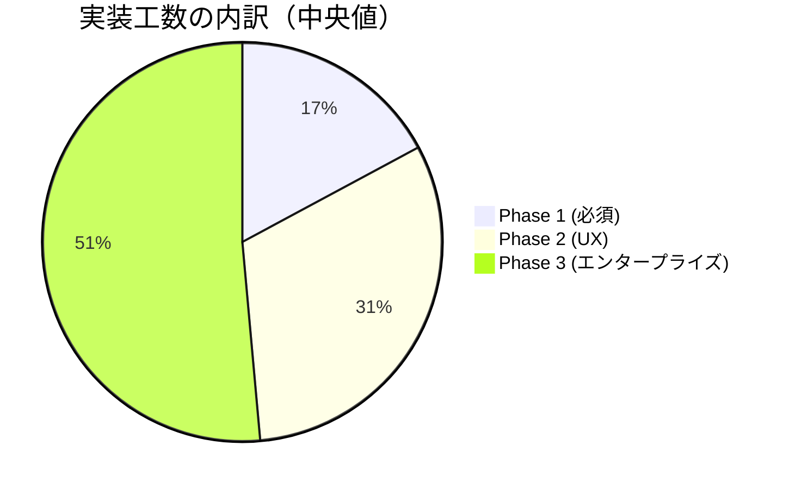
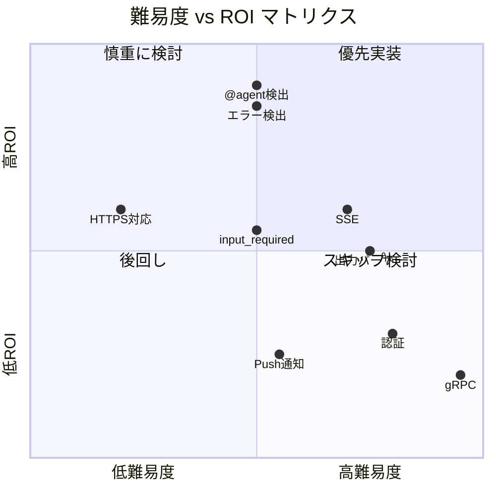
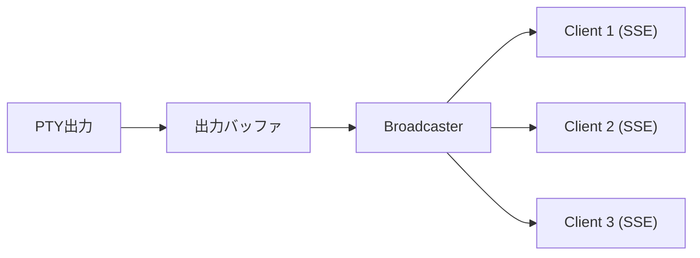
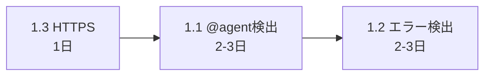
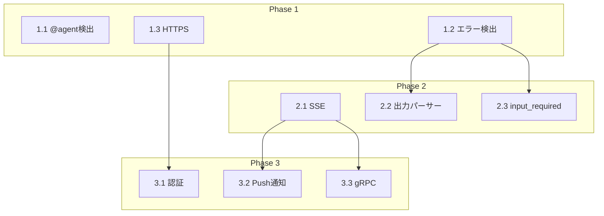

# A2A ラッパー改善 - 難易度・コスト分析

> **目的**: Synapse A2A を「A2A 非対応 CLI を A2A エコシステムに参加させるラッパー」として完成させるための工数・難易度・ROI を分析する

---

## 1. 全体サマリー

### 1.1 フェーズ別コスト概算

```
┌─────────────────────────────────────────────────────────────┐
│                    実装コスト概算                            │
├─────────────┬──────────┬──────────┬─────────────────────────┤
│ Phase       │ 工数     │ 難易度   │ ROI（費用対効果）        │
├─────────────┼──────────┼──────────┼─────────────────────────┤
│ Phase 1     │ 5-7日    │ ⭐⭐     │ ★★★ 高（必須機能）     │
│ Phase 2     │ 10-13日  │ ⭐⭐⭐   │ ★★ 中（UX改善）        │
│ Phase 3     │ 15-21日  │ ⭐⭐⭐⭐ │ ★ 低（エンタープライズ） │
├─────────────┼──────────┼──────────┼─────────────────────────┤
│ 合計        │ 30-41日  │          │                         │
└─────────────┴──────────┴──────────┴─────────────────────────┘
```

### 1.2 視覚的コスト比較



### 1.3 難易度マトリクス



---

## 2. Phase 1 詳細分析（必須改善）

**合計工数**: 5-7日
**難易度**: ⭐⭐ 中
**ROI**: ★★★ 高

### 2.1 CLI 出力からの @agent 自動ルーティング

| 項目 | 内容 |
|------|------|
| **工数** | 2-3日 |
| **難易度** | ⭐⭐ 中 |
| **ROI** | ★★★ 最高 |

#### 技術的課題

| 課題 | リスク | 対策 |
|------|--------|------|
| 出力バッファのタイミング | 中 | チャンク単位でパターンマッチング |
| 誤検出（メールアドレス等） | 中 | `@synapse-` プレフィックス必須化 |
| 複数行にまたがるメッセージ | 低 | 改行までを1メッセージとして扱う |
| 無限ループ防止 | 中 | 送信元agent_idのフィルタリング |

#### 実装詳細

```python
# 変更ファイル: synapse/controller.py
# 追加コード量: 約50行

def read_callback(fd):
    data = os.read(fd, 1024)
    text = data.decode('utf-8', errors='replace')

    # @synapse-{type}-{port} パターンのみ検出（誤検出防止）
    a2a_pattern = re.compile(r'@(synapse-[\w-]+-\d+)\s+(.+?)(?:\n|$)')
    for match in a2a_pattern.finditer(text):
        target_agent, message = match.groups()
        # 自分自身への送信は無視
        if target_agent != self.agent_id:
            self._route_to_agent(target_agent, message)

    return data
```

---

### 2.2 エラー状態の検出と failed ステータス

| 項目 | 内容 |
|------|------|
| **工数** | 2-3日 |
| **難易度** | ⭐⭐ 中 |
| **ROI** | ★★★ 高 |

#### 技術的課題

| 課題 | リスク | 対策 |
|------|--------|------|
| LLM出力パターンの多様性 | 高 | 複数パターンの段階的追加 |
| 誤判定（正常なエラー説明） | 中 | コンテキスト考慮、直近N行のみ評価 |
| 多言語対応 | 低 | 英語パターンを優先、日本語は追加 |

#### エラーパターン定義（初期版）

```python
ERROR_PATTERNS = [
    # システムエラー
    (r'error:', 'CLI_ERROR'),
    (r'failed:', 'EXECUTION_FAILED'),
    (r'exception:', 'EXCEPTION'),
    (r'traceback', 'PYTHON_ERROR'),

    # コマンドエラー
    (r'command not found', 'COMMAND_NOT_FOUND'),
    (r'permission denied', 'PERMISSION_DENIED'),
    (r'no such file', 'FILE_NOT_FOUND'),

    # エージェント拒否
    (r"I cannot|I'm unable to|I can't", 'AGENT_REFUSED'),
    (r"I don't have|I do not have", 'CAPABILITY_MISSING'),
]
```

---

### 2.3 HTTPS 対応

| 項目 | 内容 |
|------|------|
| **工数** | 1日 |
| **難易度** | ⭐ 低 |
| **ROI** | ★★ 中 |

#### 技術的課題

| 課題 | リスク | 対策 |
|------|--------|------|
| 証明書管理 | 低 | オプション引数で指定 |
| 開発環境での自己署名 | 低 | 自動生成オプション提供 |

#### 実装詳細

```python
# 変更ファイル: synapse/cli.py, synapse/server.py
# 追加コード量: 約20行

@click.option('--ssl-cert', default=None, help='SSL certificate file')
@click.option('--ssl-key', default=None, help='SSL key file')
@click.option('--ssl-auto', is_flag=True, help='Auto-generate self-signed cert')
```

---

## 3. Phase 2 詳細分析（実用性向上）

**合計工数**: 10-13日
**難易度**: ⭐⭐⭐ 高
**ROI**: ★★ 中

### 3.1 SSE ストリーミング対応

| 項目 | 内容 |
|------|------|
| **工数** | 4-5日 |
| **難易度** | ⭐⭐⭐ 高 |
| **ROI** | ★★ 中 |

#### 技術的課題

| 課題 | リスク | 対策 |
|------|--------|------|
| 非同期処理の複雑さ | 高 | asyncio ベースの設計 |
| 接続断時のリソースリーク | 中 | タイムアウトとクリーンアップ |
| 複数クライアントの同時接続 | 中 | ブロードキャスト機構 |
| PTY出力との同期 | 高 | キューベースのバッファリング |

#### 実装アーキテクチャ



---

### 3.2 出力パーサー（構造化 Artifact）

| 項目 | 内容 |
|------|------|
| **工数** | 4-5日 |
| **難易度** | ⭐⭐⭐ 高 |
| **ROI** | ★★ 中 |

#### 技術的課題

| 課題 | リスク | 対策 |
|------|--------|------|
| マークダウン解析の複雑さ | 高 | 段階的実装（コードブロックから） |
| ANSIエスケープシーケンス | 中 | strip_ansi ユーティリティ |
| ネストした構造 | 高 | 木構造パーサー |

#### 対応するArtifactタイプ

| タイプ | 検出パターン | 優先度 |
|--------|-------------|--------|
| `code` | ` ``` ` ブロック | 高 |
| `file` | ファイル作成/更新メッセージ | 高 |
| `error` | エラーパターン | 高 |
| `command` | `$ ` プレフィックス | 中 |
| `text` | その他すべて | デフォルト |

---

### 3.3 input_required 状態の検出

| 項目 | 内容 |
|------|------|
| **工数** | 2-3日 |
| **難易度** | ⭐⭐ 中 |
| **ROI** | ★★ 中 |

#### 検出パターン

```python
INPUT_REQUIRED_PATTERNS = [
    r'\?\s*$',                      # 末尾が ?
    r'\[y/n\]\s*$',                # y/n 確認
    r'\[Y/n\]\s*$',                # Y/n 確認
    r'enter\s+.*:\s*$',            # Enter X:
    r'input.*:\s*$',               # Input:
    r'please\s+provide',           # Please provide
    r'waiting\s+for\s+input',      # Waiting for input
    r'press\s+enter',              # Press Enter
]
```

---

## 4. Phase 3 詳細分析（エンタープライズ対応）

**合計工数**: 15-21日
**難易度**: ⭐⭐⭐⭐ 非常に高
**ROI**: ★ 低（ローカル利用なら不要）

### 4.1 認証/認可

| 項目 | 内容 |
|------|------|
| **工数** | 5-7日 |
| **難易度** | ⭐⭐⭐ 高 |

#### 実装オプション

| 方式 | 工数 | 複雑さ | 推奨 |
|------|------|--------|------|
| API Key | 2日 | 低 | ✅ 初期実装 |
| Basic Auth | 1日 | 低 | |
| OAuth2 | 5日 | 高 | 将来オプション |
| mTLS | 3日 | 中 | 高セキュリティ環境 |

---

### 4.2 Push Notifications

| 項目 | 内容 |
|------|------|
| **工数** | 3-4日 |
| **難易度** | ⭐⭐ 中 |

---

### 4.3 gRPC 対応

| 項目 | 内容 |
|------|------|
| **工数** | 7-10日 |
| **難易度** | ⭐⭐⭐⭐ 非常に高 |

#### 技術的課題

| 課題 | リスク | 対策 |
|------|--------|------|
| Protobuf 定義 | 中 | A2A 公式 .proto を参照 |
| 既存コードとの統合 | 高 | 抽象化レイヤーの追加 |
| 双方向ストリーミング | 高 | 段階的実装 |

---

## 5. 推奨実装順序とROI分析

### 5.1 最小実装（Phase 1 のみ）



**工数**: 5-7日
**達成できること**:
- CLI が他エージェントを呼べる
- タスクの成否が分かる
- 基本的なセキュリティ

### 5.2 実用的実装（Phase 1 + 2）

**工数**: 15-20日
**達成できること**:
- リアルタイム出力（SSE）
- 構造化された出力
- 対話的タスクのサポート

### 5.3 完全実装（全フェーズ）

**工数**: 30-41日
**達成できること**:
- エンタープライズ環境での利用
- 外部公開可能
- 高性能通信（gRPC）

---

## 6. リスクと対策

### 6.1 技術的リスク

| リスク | 影響度 | 発生確率 | 対策 |
|--------|--------|----------|------|
| LLM出力の予測困難性 | 高 | 高 | パターンの段階的拡張 |
| PTY制御の複雑さ | 中 | 中 | 既存実装の流用 |
| 非同期処理のバグ | 高 | 中 | 徹底したテスト |

### 6.2 スケジュールリスク

| リスク | 影響度 | 対策 |
|--------|--------|------|
| 想定外の技術課題 | 高 | バッファ日数の確保（+20%） |
| 要件変更 | 中 | Phase 単位でのリリース |

---

## 7. 依存関係図



---

## 8. 結論

### 推奨アプローチ

| シナリオ | 推奨フェーズ | 工数 |
|----------|------------|------|
| **ローカル開発のみ** | Phase 1 | 5-7日 |
| **チーム利用** | Phase 1 + 2 | 15-20日 |
| **外部公開/エンタープライズ** | 全フェーズ | 30-41日 |

### 最優先タスク

1. **1.1 CLI出力からの@agent検出** - ラッパーの核心機能
2. **1.2 エラー状態の検出** - A2A 準拠に必須
3. **1.3 HTTPS対応** - 最も低コストで効果的

---

## 関連ドキュメント

- [wrapper-improvements.md](./wrapper-improvements.md) - 実装ロードマップ
- [docs/a2a-design-rationale.md](../../docs/a2a-design-rationale.md) - 設計思想
- [guides/google-a2a-spec.md](../../guides/google-a2a-spec.md) - A2A プロトコル仕様

---

## 更新履歴

| 日付 | 内容 |
|------|------|
| 2025-12-28 | 初版作成 |
