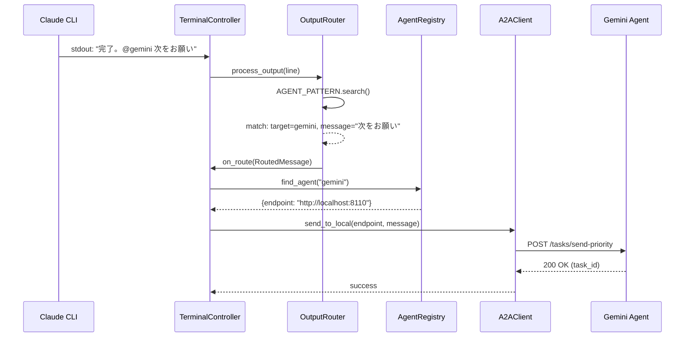
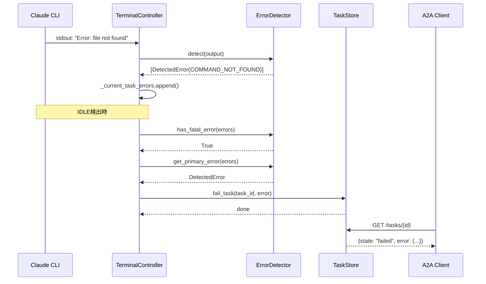

# Phase 1 設計書: 基本機能強化

**バージョン**: 1.0
**作成日**: 2025-12-29
**ステータス**: Draft

---

## 目次

1. [概要](#1-概要)
2. [1.1 CLI出力からの@agent自動ルーティング](#11-cli出力からのagent自動ルーティング)
3. [1.2 エラー状態の検出](#12-エラー状態の検出)
4. [1.3 HTTPS対応](#13-https対応)
5. [共通設計事項](#共通設計事項)
6. [マイグレーション計画](#マイグレーション計画)

---

## 1. 概要

### 1.1 Phase 1 の目標

Phase 1 では、Synapse A2A を **実用的なA2Aラッパー** として機能させるための基本機能を実装する。

| 機能 | 目的 | 優先度 |
|------|------|--------|
| CLI出力からの@agent自動ルーティング | エージェント間の自律的通信を実現 | 高 |
| エラー状態の検出 | タスク失敗の正確な報告 | 高 |
| HTTPS対応 | セキュアな通信基盤 | 中 |

### 1.2 設計原則

1. **後方互換性**: 既存機能を壊さない
2. **設定可能**: 機能のON/OFFが可能
3. **段階的導入**: 各機能を独立してデプロイ可能
4. **テスタブル**: ユニットテストで検証可能

---

## 1.1 CLI出力からの@agent自動ルーティング

### 目的

CLI（Claude Code, Gemini CLI等）の出力に含まれる `@agent message` パターンを検出し、自動的に対象エージェントへルーティングする。これにより、エージェント同士が人間の介入なしに通信できるようになる。

### 現状の問題

```
[現状]
Claude CLI → "タスク完了。@gemini 次の処理をお願い" → 画面に表示されるだけ
                                                    ↑
                                            転送されない
```

### 目標の動作

```
[目標]
Claude CLI → "タスク完了。@gemini 次の処理をお願い"
                    ↓
            OutputRouter が検出
                    ↓
            Gemini エージェントへ自動転送
```

### アーキテクチャ

```
┌─────────────────────────────────────────────────────────────┐
│                    TerminalController                        │
├─────────────────────────────────────────────────────────────┤
│  ┌─────────┐    ┌──────────────┐    ┌─────────────────┐    │
│  │  PTY    │───▶│ OutputRouter │───▶│ AgentRegistry   │    │
│  │ stdout  │    │  (NEW)       │    │                 │    │
│  └─────────┘    └──────┬───────┘    └─────────────────┘    │
│                        │                                    │
│                        ▼                                    │
│                 ┌──────────────┐                            │
│                 │  A2AClient   │                            │
│                 └──────────────┘                            │
└─────────────────────────────────────────────────────────────┘
```

### 新規クラス: OutputRouter

```python
# synapse/output_router.py

from dataclasses import dataclass
from typing import Optional, Callable, List
import re
import logging

logger = logging.getLogger(__name__)


@dataclass
class RoutedMessage:
    """検出されたルーティング対象メッセージ"""
    target_agent: str      # 送信先エージェント名
    message: str           # メッセージ本文
    source_agent: str      # 送信元エージェントID
    original_line: str     # 元の出力行
    priority: int = 1      # 優先度 (デフォルト: 1)


class OutputRouter:
    """CLI出力から@agentパターンを検出してルーティングする"""

    # @agent パターン: @エージェント名 メッセージ
    # オプションで --priority N を指定可能
    AGENT_PATTERN = re.compile(
        r'@([\w-]+)(?:\s+--priority\s+(\d))?(?:\s+--response)?\s+(.+)',
        re.MULTILINE
    )

    # 無視すべきパターン（自分宛ての指示など）
    IGNORE_PATTERNS = [
        r'\[SYNAPSE A2A\]',           # システムメッセージ
        r'あなたのアイデンティティ',    # Identity命令
        r'ルーティングルール',          # ルーティング説明
    ]

    def __init__(
        self,
        source_agent_id: str,
        enabled: bool = True,
        on_route: Optional[Callable[[RoutedMessage], None]] = None
    ):
        """
        Args:
            source_agent_id: このルーターを所有するエージェントのID
            enabled: ルーティング機能の有効/無効
            on_route: メッセージ検出時のコールバック
        """
        self.source_agent_id = source_agent_id
        self.enabled = enabled
        self.on_route = on_route
        self._ignore_patterns = [
            re.compile(p) for p in self.IGNORE_PATTERNS
        ]

    def process_output(self, output: str) -> List[RoutedMessage]:
        """
        CLI出力を処理し、ルーティング対象メッセージを抽出する

        Args:
            output: CLI出力テキスト

        Returns:
            検出されたRoutedMessageのリスト
        """
        if not self.enabled:
            return []

        messages = []

        for line in output.split('\n'):
            # 無視パターンのチェック
            if self._should_ignore(line):
                continue

            # @agent パターンの検出
            match = self.AGENT_PATTERN.search(line)
            if match:
                target = match.group(1)
                priority_str = match.group(2)
                message = match.group(3).strip()

                # 自分自身への送信は無視
                if self._is_self_reference(target):
                    logger.debug(f"Self-reference ignored: {target}")
                    continue

                priority = int(priority_str) if priority_str else 1

                routed = RoutedMessage(
                    target_agent=target,
                    message=message,
                    source_agent=self.source_agent_id,
                    original_line=line,
                    priority=priority
                )
                messages.append(routed)
                logger.info(
                    f"Detected routed message: {target} <- {message[:50]}..."
                )

                # コールバック呼び出し
                if self.on_route:
                    self.on_route(routed)

        return messages

    def _should_ignore(self, line: str) -> bool:
        """指定行を無視すべきかチェック"""
        for pattern in self._ignore_patterns:
            if pattern.search(line):
                return True
        return False

    def _is_self_reference(self, target: str) -> bool:
        """自己参照かどうかをチェック"""
        # 完全一致
        if target == self.source_agent_id:
            return True
        # タイプのみの指定（例: claude）
        if f"synapse-{target}-" in self.source_agent_id:
            return True
        return False
```

### TerminalController への統合

```python
# synapse/controller.py への追加

class TerminalController:
    def __init__(
        self,
        # ... 既存のパラメータ ...
        output_routing_enabled: bool = False,  # 新規追加
    ):
        # ... 既存の初期化 ...

        # OutputRouter の初期化
        self.output_router: Optional[OutputRouter] = None
        self._output_routing_enabled = output_routing_enabled

    def _setup_output_router(self):
        """OutputRouterの遅延初期化（agent_id確定後に呼び出し）"""
        if self._output_routing_enabled and self.agent_id:
            from synapse.output_router import OutputRouter
            self.output_router = OutputRouter(
                source_agent_id=self.agent_id,
                enabled=True,
                on_route=self._handle_routed_message
            )

    def _handle_routed_message(self, message: RoutedMessage):
        """ルーティングされたメッセージを処理"""
        from synapse.a2a_client import A2AClient
        from synapse.registry import AgentRegistry

        registry = AgentRegistry()
        client = A2AClient(registry)

        # エージェント解決
        agent = registry.find_agent(message.target_agent)
        if agent:
            # ローカルエージェントへ送信
            client.send_to_local(
                agent['endpoint'],
                message.message,
                priority=message.priority
            )
            logger.info(
                f"Routed message to {message.target_agent}: "
                f"{message.message[:50]}..."
            )
        else:
            logger.warning(
                f"Target agent not found: {message.target_agent}"
            )

    def _monitor_output(self):
        """出力監視（修正版）"""
        while self.running:
            try:
                data = os.read(self.master_fd, 1024)
                if data:
                    decoded = data.decode('utf-8', errors='replace')
                    self.output_buffer += decoded

                    # OutputRouter による処理（追加）
                    if self.output_router:
                        self.output_router.process_output(decoded)

                    # ... 既存の処理 ...
```

### プロファイル設定の追加

```yaml
# synapse/profiles/claude.yaml
name: claude
command: claude
idle_regex: '(claude|>|❯)\s*$'

# 新規追加
output_routing:
  enabled: true
  # 追加の無視パターン（オプション）
  ignore_patterns:
    - "考え中..."
    - "Processing..."
```

### シーケンス図



### 設定オプション

| オプション | デフォルト | 説明 |
|-----------|----------|------|
| `output_routing.enabled` | `false` | 出力ルーティングの有効化 |
| `output_routing.ignore_patterns` | `[]` | 追加の無視パターン |
| `output_routing.buffer_delay_ms` | `100` | バッファリング遅延 |

### テスト計画

```python
# tests/test_output_router.py

class TestOutputRouter:
    def test_detects_agent_pattern(self):
        """@agent パターンを検出できる"""
        router = OutputRouter("synapse-claude-8100")
        messages = router.process_output("タスク完了。@gemini 次をお願い")
        assert len(messages) == 1
        assert messages[0].target_agent == "gemini"
        assert messages[0].message == "次をお願い"

    def test_ignores_self_reference(self):
        """自己参照を無視する"""
        router = OutputRouter("synapse-claude-8100")
        messages = router.process_output("@claude これは自分宛て")
        assert len(messages) == 0

    def test_ignores_system_messages(self):
        """システムメッセージを無視する"""
        router = OutputRouter("synapse-claude-8100")
        messages = router.process_output("[SYNAPSE A2A] @gemini test")
        assert len(messages) == 0

    def test_extracts_priority(self):
        """優先度を抽出できる"""
        router = OutputRouter("synapse-claude-8100")
        messages = router.process_output("@gemini --priority 5 緊急！")
        assert messages[0].priority == 5

    def test_disabled_returns_empty(self):
        """無効時は空リストを返す"""
        router = OutputRouter("synapse-claude-8100", enabled=False)
        messages = router.process_output("@gemini test")
        assert len(messages) == 0

    def test_multiple_messages(self):
        """複数メッセージを検出できる"""
        router = OutputRouter("synapse-claude-8100")
        output = """
        @gemini タスク1をお願い
        途中の出力
        @codex タスク2をお願い
        """
        messages = router.process_output(output)
        assert len(messages) == 2

    def test_callback_invoked(self):
        """コールバックが呼び出される"""
        received = []
        router = OutputRouter(
            "synapse-claude-8100",
            on_route=lambda m: received.append(m)
        )
        router.process_output("@gemini test")
        assert len(received) == 1
```

### 実装リスク

| リスク | 対策 |
|--------|------|
| 出力バッファのタイミング | 遅延処理でバッファリング |
| 誤検出（コードブロック内の@） | コードブロック検出を追加 |
| 無限ループ（エージェント間） | 送信履歴でループ検出 |

---

## 1.2 エラー状態の検出

### 目的

CLI出力からエラーパターンを検出し、A2Aタスクのステータスを `failed` に正確に設定する。

### 現状の問題

```
[現状]
CLI → "Error: command not found"
         ↓
Task status = "completed"  ← 常にcompletedになる
```

### 目標の動作

```
[目標]
CLI → "Error: command not found"
         ↓
ErrorDetector が検出
         ↓
Task status = "failed"
Task error = { code: "CLI_ERROR", message: "..." }
```

### 新規クラス: ErrorDetector

```python
# synapse/error_detector.py

from dataclasses import dataclass
from typing import Optional, List, Tuple
from enum import Enum
import re
import logging

logger = logging.getLogger(__name__)


class ErrorCode(Enum):
    """A2A準拠のエラーコード"""
    CLI_ERROR = "CLI_ERROR"
    EXECUTION_FAILED = "EXECUTION_FAILED"
    COMMAND_NOT_FOUND = "COMMAND_NOT_FOUND"
    PERMISSION_DENIED = "PERMISSION_DENIED"
    TIMEOUT = "TIMEOUT"
    OUT_OF_MEMORY = "OUT_OF_MEMORY"
    SYNTAX_ERROR = "SYNTAX_ERROR"
    NETWORK_ERROR = "NETWORK_ERROR"
    UNKNOWN_ERROR = "UNKNOWN_ERROR"


@dataclass
class DetectedError:
    """検出されたエラー情報"""
    code: ErrorCode
    message: str
    original_line: str
    severity: str = "error"  # "error" | "warning"

    def to_a2a_error(self) -> dict:
        """A2A準拠のエラーオブジェクトに変換"""
        return {
            "code": self.code.value,
            "message": self.message,
            "data": {
                "original_output": self.original_line,
                "severity": self.severity
            }
        }


class ErrorDetector:
    """CLI出力からエラーを検出する"""

    # エラーパターン定義: (正規表現, ErrorCode, 重要度)
    DEFAULT_PATTERNS: List[Tuple[str, ErrorCode, str]] = [
        # 汎用エラー
        (r'(?i)^error:', ErrorCode.CLI_ERROR, "error"),
        (r'(?i)failed:', ErrorCode.EXECUTION_FAILED, "error"),
        (r'(?i)exception:', ErrorCode.CLI_ERROR, "error"),

        # コマンド系
        (r'command not found', ErrorCode.COMMAND_NOT_FOUND, "error"),
        (r'not found:', ErrorCode.COMMAND_NOT_FOUND, "error"),

        # 権限系
        (r'(?i)permission denied', ErrorCode.PERMISSION_DENIED, "error"),
        (r'(?i)access denied', ErrorCode.PERMISSION_DENIED, "error"),

        # リソース系
        (r'(?i)out of memory', ErrorCode.OUT_OF_MEMORY, "error"),
        (r'(?i)memory allocation', ErrorCode.OUT_OF_MEMORY, "error"),
        (r'(?i)timed? ?out', ErrorCode.TIMEOUT, "error"),

        # 構文系
        (r'(?i)syntax error', ErrorCode.SYNTAX_ERROR, "error"),
        (r'(?i)parse error', ErrorCode.SYNTAX_ERROR, "error"),

        # ネットワーク系
        (r'(?i)connection refused', ErrorCode.NETWORK_ERROR, "error"),
        (r'(?i)network.*unreachable', ErrorCode.NETWORK_ERROR, "error"),

        # 警告（タスクは失敗にしないが記録）
        (r'(?i)^warning:', ErrorCode.CLI_ERROR, "warning"),
        (r'(?i)deprecated', ErrorCode.CLI_ERROR, "warning"),
    ]

    def __init__(
        self,
        additional_patterns: Optional[List[Tuple[str, ErrorCode, str]]] = None,
        enabled: bool = True
    ):
        """
        Args:
            additional_patterns: 追加のエラーパターン
            enabled: 検出機能の有効/無効
        """
        self.enabled = enabled
        self._patterns = []

        # デフォルトパターンをコンパイル
        for pattern, code, severity in self.DEFAULT_PATTERNS:
            self._patterns.append((
                re.compile(pattern, re.IGNORECASE | re.MULTILINE),
                code,
                severity
            ))

        # 追加パターン
        if additional_patterns:
            for pattern, code, severity in additional_patterns:
                self._patterns.append((
                    re.compile(pattern, re.IGNORECASE | re.MULTILINE),
                    code,
                    severity
                ))

    def detect(self, output: str) -> List[DetectedError]:
        """
        出力からエラーを検出する

        Args:
            output: CLI出力テキスト

        Returns:
            検出されたエラーのリスト
        """
        if not self.enabled:
            return []

        errors = []

        for line in output.split('\n'):
            line = line.strip()
            if not line:
                continue

            for pattern, code, severity in self._patterns:
                if pattern.search(line):
                    error = DetectedError(
                        code=code,
                        message=line[:200],  # 最大200文字
                        original_line=line,
                        severity=severity
                    )
                    errors.append(error)
                    logger.debug(f"Error detected: {code.value} - {line[:50]}")
                    break  # 1行につき1エラーのみ

        return errors

    def has_fatal_error(self, errors: List[DetectedError]) -> bool:
        """致命的エラー（タスクを失敗にすべき）があるか"""
        return any(e.severity == "error" for e in errors)

    def get_primary_error(
        self, errors: List[DetectedError]
    ) -> Optional[DetectedError]:
        """最も重要なエラーを取得"""
        fatal_errors = [e for e in errors if e.severity == "error"]
        if fatal_errors:
            return fatal_errors[0]
        return errors[0] if errors else None
```

### TaskStore への統合

```python
# synapse/a2a_compat.py への追加

class TaskStore:
    def fail_task(
        self,
        task_id: str,
        error: dict,
        artifacts: Optional[List[Artifact]] = None
    ):
        """タスクを失敗状態にする"""
        with self._lock:
            if task_id in self._tasks:
                task = self._tasks[task_id]
                task.status = TaskState(state="failed")
                task.status.error = error
                if artifacts:
                    task.artifacts = artifacts
                self._tasks[task_id] = task
```

### TerminalController への統合

```python
# synapse/controller.py への追加

class TerminalController:
    def __init__(self, ...):
        # ... 既存 ...
        self.error_detector = ErrorDetector()
        self._current_task_errors: List[DetectedError] = []

    def _monitor_output(self):
        """出力監視（修正版）"""
        while self.running:
            try:
                data = os.read(self.master_fd, 1024)
                if data:
                    decoded = data.decode('utf-8', errors='replace')
                    self.output_buffer += decoded

                    # エラー検出（追加）
                    errors = self.error_detector.detect(decoded)
                    self._current_task_errors.extend(errors)

                    # ... 既存の処理 ...

    def _complete_task(self, task_id: str):
        """タスク完了処理（修正版）"""
        if self.error_detector.has_fatal_error(self._current_task_errors):
            primary_error = self.error_detector.get_primary_error(
                self._current_task_errors
            )
            self.task_store.fail_task(
                task_id,
                error=primary_error.to_a2a_error()
            )
        else:
            self.task_store.complete_task(task_id, ...)

        # エラーリストをクリア
        self._current_task_errors = []
```

### プロファイル設定の追加

```yaml
# synapse/profiles/claude.yaml
error_detection:
  enabled: true
  # CLI固有のエラーパターン
  additional_patterns:
    - pattern: "API rate limit"
      code: "RATE_LIMIT"
      severity: "error"
    - pattern: "context length exceeded"
      code: "CONTEXT_OVERFLOW"
      severity: "error"
```

### シーケンス図



### テスト計画

```python
# tests/test_error_detector.py

class TestErrorDetector:
    def test_detects_generic_error(self):
        """汎用エラーを検出できる"""
        detector = ErrorDetector()
        errors = detector.detect("Error: something went wrong")
        assert len(errors) == 1
        assert errors[0].code == ErrorCode.CLI_ERROR

    def test_detects_command_not_found(self):
        """コマンド未検出エラーを検出できる"""
        detector = ErrorDetector()
        errors = detector.detect("bash: foo: command not found")
        assert errors[0].code == ErrorCode.COMMAND_NOT_FOUND

    def test_detects_permission_denied(self):
        """権限エラーを検出できる"""
        detector = ErrorDetector()
        errors = detector.detect("Permission denied: /etc/shadow")
        assert errors[0].code == ErrorCode.PERMISSION_DENIED

    def test_warning_not_fatal(self):
        """警告は致命的でない"""
        detector = ErrorDetector()
        errors = detector.detect("Warning: deprecated feature")
        assert not detector.has_fatal_error(errors)

    def test_to_a2a_error_format(self):
        """A2A形式に変換できる"""
        error = DetectedError(
            code=ErrorCode.CLI_ERROR,
            message="Test error",
            original_line="Error: Test error"
        )
        a2a_error = error.to_a2a_error()
        assert a2a_error["code"] == "CLI_ERROR"
        assert "message" in a2a_error

    def test_additional_patterns(self):
        """追加パターンが機能する"""
        detector = ErrorDetector(
            additional_patterns=[
                (r'custom error', ErrorCode.UNKNOWN_ERROR, "error")
            ]
        )
        errors = detector.detect("custom error occurred")
        assert len(errors) == 1

    def test_disabled_returns_empty(self):
        """無効時は空リストを返す"""
        detector = ErrorDetector(enabled=False)
        errors = detector.detect("Error: test")
        assert len(errors) == 0
```

---

## 1.3 HTTPS対応

### 目的

A2Aエンドポイントへの通信をHTTPSで暗号化し、セキュアな通信を実現する。

### 実装方針

1. **自己署名証明書**: 開発環境向け
2. **Let's Encrypt**: 本番環境向け（将来）
3. **HTTPフォールバック**: 下位互換性のため維持

### アーキテクチャ

```
┌─────────────────────────────────────────────────────┐
│                    FastAPI Server                    │
├─────────────────────────────────────────────────────┤
│  ┌─────────────────────────────────────────────┐   │
│  │              Uvicorn                         │   │
│  │  ┌─────────────────┬─────────────────────┐  │   │
│  │  │  HTTP (8100)    │  HTTPS (8100+100)   │  │   │
│  │  │  (開発/フォール │  (推奨)             │  │   │
│  │  │  バック)        │                     │  │   │
│  │  └─────────────────┴─────────────────────┘  │   │
│  └─────────────────────────────────────────────┘   │
└─────────────────────────────────────────────────────┘
```

### SSL設定クラス

```python
# synapse/ssl_config.py

from pathlib import Path
from dataclasses import dataclass
from typing import Optional
import ssl
import subprocess
import logging

logger = logging.getLogger(__name__)


@dataclass
class SSLConfig:
    """SSL設定"""
    enabled: bool = False
    cert_file: Optional[Path] = None
    key_file: Optional[Path] = None
    ca_file: Optional[Path] = None
    verify_client: bool = False  # mTLS用

    @classmethod
    def create_self_signed(
        cls,
        output_dir: Path,
        common_name: str = "localhost"
    ) -> 'SSLConfig':
        """自己署名証明書を生成"""
        output_dir.mkdir(parents=True, exist_ok=True)

        key_file = output_dir / "server.key"
        cert_file = output_dir / "server.crt"

        # OpenSSLで生成
        subprocess.run([
            "openssl", "req", "-x509", "-newkey", "rsa:4096",
            "-keyout", str(key_file),
            "-out", str(cert_file),
            "-days", "365",
            "-nodes",
            "-subj", f"/CN={common_name}",
            "-addext", f"subjectAltName=DNS:{common_name},IP:127.0.0.1"
        ], check=True, capture_output=True)

        logger.info(f"Self-signed certificate created: {cert_file}")

        return cls(
            enabled=True,
            cert_file=cert_file,
            key_file=key_file
        )

    def get_ssl_context(self) -> Optional[ssl.SSLContext]:
        """SSLコンテキストを取得"""
        if not self.enabled or not self.cert_file or not self.key_file:
            return None

        context = ssl.create_default_context(ssl.Purpose.CLIENT_AUTH)
        context.load_cert_chain(
            certfile=str(self.cert_file),
            keyfile=str(self.key_file)
        )

        if self.verify_client and self.ca_file:
            context.verify_mode = ssl.CERT_REQUIRED
            context.load_verify_locations(cafile=str(self.ca_file))

        return context


class SSLManager:
    """SSL証明書の管理"""

    DEFAULT_CERT_DIR = Path.home() / ".a2a" / "certs"

    def __init__(self, cert_dir: Optional[Path] = None):
        self.cert_dir = cert_dir or self.DEFAULT_CERT_DIR

    def ensure_certificates(self, agent_id: str) -> SSLConfig:
        """証明書が存在することを確認し、なければ生成"""
        agent_cert_dir = self.cert_dir / agent_id
        key_file = agent_cert_dir / "server.key"
        cert_file = agent_cert_dir / "server.crt"

        if key_file.exists() and cert_file.exists():
            logger.info(f"Using existing certificates: {cert_file}")
            return SSLConfig(
                enabled=True,
                cert_file=cert_file,
                key_file=key_file
            )
        else:
            return SSLConfig.create_self_signed(
                agent_cert_dir,
                common_name="localhost"
            )
```

### サーバー起動の修正

```python
# synapse/server.py への追加

def start_server(
    host: str = "0.0.0.0",
    port: int = 8100,
    ssl_config: Optional[SSLConfig] = None
):
    """サーバー起動"""
    import uvicorn

    ssl_keyfile = None
    ssl_certfile = None

    if ssl_config and ssl_config.enabled:
        ssl_keyfile = str(ssl_config.key_file)
        ssl_certfile = str(ssl_config.cert_file)
        logger.info(f"HTTPS enabled on port {port}")
    else:
        logger.info(f"HTTP mode on port {port}")

    uvicorn.run(
        app,
        host=host,
        port=port,
        ssl_keyfile=ssl_keyfile,
        ssl_certfile=ssl_certfile
    )
```

### A2AClient のHTTPS対応

```python
# synapse/a2a_client.py への追加

class A2AClient:
    def __init__(
        self,
        registry: AgentRegistry,
        verify_ssl: bool = True,
        ca_bundle: Optional[Path] = None
    ):
        self.registry = registry
        self.verify_ssl = verify_ssl
        self.ca_bundle = ca_bundle

    def _get_session(self) -> httpx.Client:
        """HTTPクライアントを取得"""
        verify = self.ca_bundle or self.verify_ssl
        return httpx.Client(verify=verify, timeout=30.0)

    def send_to_local(
        self,
        endpoint: str,
        message: str,
        priority: int = 1,
        use_https: bool = False
    ):
        """ローカルエージェントへ送信"""
        if use_https:
            endpoint = endpoint.replace("http://", "https://")

        with self._get_session() as client:
            response = client.post(
                f"{endpoint}/tasks/send-priority",
                json={"message": message, "priority": priority}
            )
            return response.json()
```

### プロファイル設定の追加

```yaml
# synapse/profiles/claude.yaml
ssl:
  enabled: true
  # 自動生成（推奨）
  auto_generate: true
  # または手動指定
  # cert_file: /path/to/cert.pem
  # key_file: /path/to/key.pem
```

### CLI オプションの追加

```bash
# HTTPS有効化
synapse start claude --https

# 証明書を指定
synapse start claude --https --cert /path/to/cert.pem --key /path/to/key.pem
```

### テスト計画

```python
# tests/test_ssl_config.py

class TestSSLConfig:
    def test_create_self_signed(self, tmp_path):
        """自己署名証明書を生成できる"""
        config = SSLConfig.create_self_signed(tmp_path)
        assert config.enabled
        assert config.cert_file.exists()
        assert config.key_file.exists()

    def test_get_ssl_context(self, tmp_path):
        """SSLコンテキストを取得できる"""
        config = SSLConfig.create_self_signed(tmp_path)
        context = config.get_ssl_context()
        assert context is not None

    def test_disabled_returns_none(self):
        """無効時はNoneを返す"""
        config = SSLConfig(enabled=False)
        assert config.get_ssl_context() is None


class TestSSLManager:
    def test_ensure_certificates_creates_new(self, tmp_path):
        """証明書がなければ生成する"""
        manager = SSLManager(cert_dir=tmp_path)
        config = manager.ensure_certificates("test-agent")
        assert config.enabled

    def test_ensure_certificates_uses_existing(self, tmp_path):
        """既存の証明書を使用する"""
        # 事前に証明書を作成
        agent_dir = tmp_path / "test-agent"
        SSLConfig.create_self_signed(agent_dir)

        manager = SSLManager(cert_dir=tmp_path)
        config = manager.ensure_certificates("test-agent")
        assert config.enabled
```

---

## 共通設計事項

### ログ設計

```python
# すべてのモジュールで統一されたログ形式を使用
import logging

logger = logging.getLogger(__name__)

# ログレベルガイドライン
# DEBUG: 詳細なデバッグ情報（パターンマッチ結果など）
# INFO: 重要なイベント（メッセージ転送、エラー検出など）
# WARNING: 警告（エージェント未発見など）
# ERROR: エラー（接続失敗など）
```

### 設定の優先順位

1. コマンドライン引数
2. 環境変数
3. プロファイル設定（YAML）
4. デフォルト値

### エラーハンドリング方針

```python
class SynapseError(Exception):
    """基底例外クラス"""
    pass

class OutputRoutingError(SynapseError):
    """出力ルーティングエラー"""
    pass

class ErrorDetectionError(SynapseError):
    """エラー検出エラー"""
    pass

class SSLConfigError(SynapseError):
    """SSL設定エラー"""
    pass
```

---

## マイグレーション計画

### 既存ユーザーへの影響

| 機能 | デフォルト | 影響 |
|------|----------|------|
| 出力ルーティング | OFF | なし |
| エラー検出 | ON | タスクが`failed`になる可能性 |
| HTTPS | OFF | なし |

### 段階的ロールアウト

1. **Week 1**: 内部テスト
2. **Week 2**: ベータユーザーへ展開
3. **Week 3**: 全ユーザーへ展開

---

## 付録: ファイル構成

```
synapse/
├── output_router.py      # NEW: 出力ルーティング
├── error_detector.py     # NEW: エラー検出
├── ssl_config.py         # NEW: SSL設定
├── controller.py         # MODIFIED: 統合
├── server.py             # MODIFIED: HTTPS対応
├── a2a_client.py         # MODIFIED: HTTPS対応
└── a2a_compat.py         # MODIFIED: fail_task追加
```
