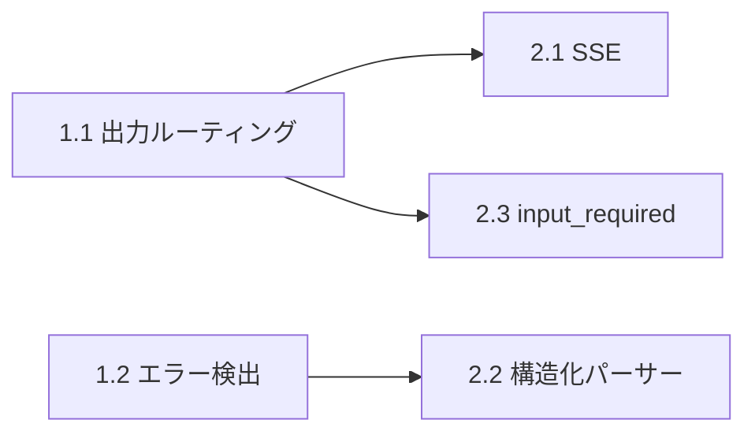
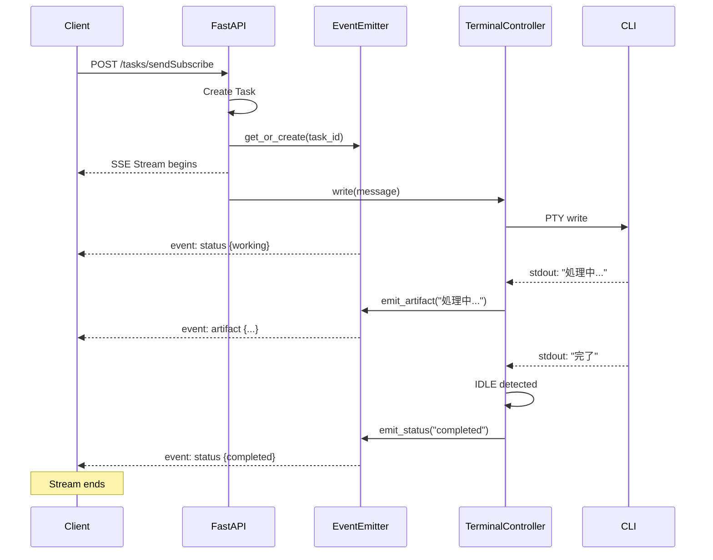
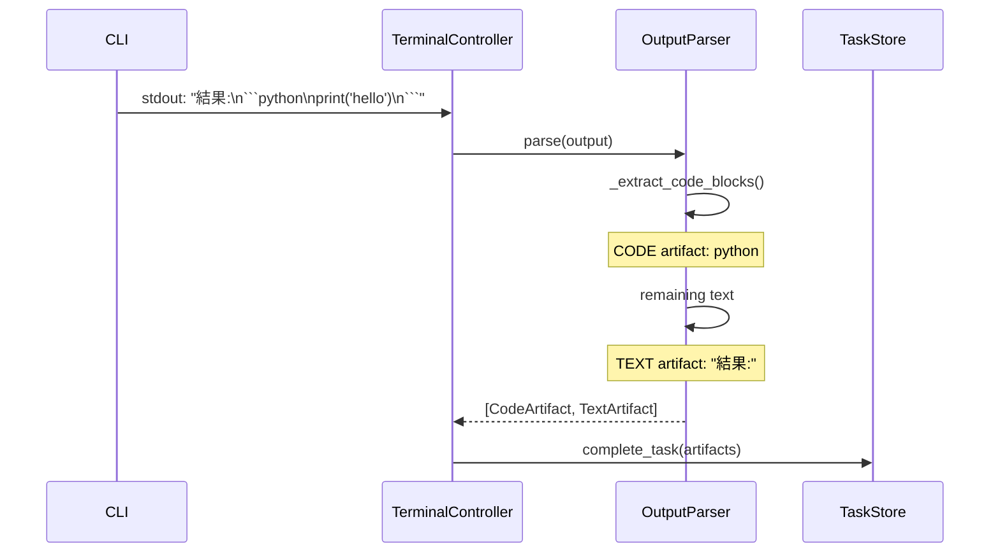
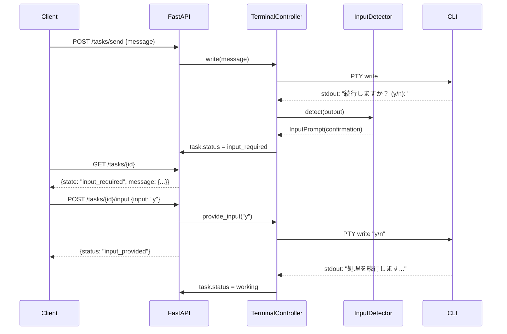

# Phase 2 設計書: UX改善・プロトコル拡張

**バージョン**: 1.0
**作成日**: 2025-12-29
**ステータス**: Draft
**前提条件**: Phase 1 完了

---

## 目次

1. [概要](#1-概要)
2. [2.1 SSE ストリーミング](#21-sse-ストリーミング)
3. [2.2 構造化出力パーサー](#22-構造化出力パーサー)
4. [2.3 input_required 状態のサポート](#23-input_required-状態のサポート)
5. [統合テスト計画](#統合テスト計画)

---

## 1. 概要

### 1.1 Phase 2 の目標

Phase 2 では、ユーザー体験（UX）を向上させ、A2Aプロトコルへの準拠度を高める。

| 機能 | 目的 | 複雑度 |
|------|------|--------|
| SSE ストリーミング | リアルタイム出力表示 | 高 |
| 構造化出力パーサー | 意味のあるArtifact生成 | 高 |
| input_required 状態 | 対話的タスクのサポート | 中 |

### 1.2 Phase 1 からの依存関係



---

## 2.1 SSE ストリーミング

### 目的

Google A2Aプロトコルの `tasks/sendSubscribe` エンドポイントを実装し、CLI出力をリアルタイムでクライアントに配信する。

### 現状の問題

```
[現状]
Client → POST /tasks/send
       ← 200 OK (task_id)
       → GET /tasks/{id} (polling)
       → GET /tasks/{id} (polling)
       → GET /tasks/{id} (polling)  ← 非効率
       ← {status: "completed"}
```

### 目標の動作

```
[目標]
Client → POST /tasks/sendSubscribe
       ← SSE stream begins
       ← event: status {state: "working"}
       ← event: artifact {type: "text", data: "処理中..."}
       ← event: artifact {type: "text", data: "完了しました"}
       ← event: status {state: "completed"}
       ← stream ends
```

### アーキテクチャ

```
┌─────────────────────────────────────────────────────────────────┐
│                         FastAPI Server                           │
├─────────────────────────────────────────────────────────────────┤
│  ┌──────────────┐    ┌─────────────────┐    ┌───────────────┐  │
│  │ /tasks/send  │    │/tasks/sendSubscr│    │ EventEmitter  │  │
│  │ Subscribe    │───▶│ibe Handler     │───▶│               │  │
│  └──────────────┘    └─────────────────┘    └───────┬───────┘  │
│                                                      │          │
│  ┌──────────────────────────────────────────────────┼────────┐ │
│  │                 TerminalController                │        │ │
│  │  ┌─────────┐    ┌──────────────┐                 │        │ │
│  │  │  PTY    │───▶│ OutputBuffer │────────────────▶│        │ │
│  │  │ stdout  │    │              │  on_output()    │        │ │
│  │  └─────────┘    └──────────────┘                          │ │
│  └───────────────────────────────────────────────────────────┘ │
└─────────────────────────────────────────────────────────────────┘
                              │
                              ▼ SSE
                     ┌────────────────┐
                     │    Client      │
                     └────────────────┘
```

### SSE イベント形式 (A2A準拠)

```typescript
// TaskStatusUpdateEvent
{
  "id": "event-uuid",
  "type": "status",
  "data": {
    "taskId": "task-uuid",
    "state": "working" | "completed" | "failed" | "input_required",
    "timestamp": "2025-12-29T12:00:00Z"
  }
}

// TaskArtifactUpdateEvent
{
  "id": "event-uuid",
  "type": "artifact",
  "data": {
    "taskId": "task-uuid",
    "artifact": {
      "type": "text",
      "name": "output",
      "parts": [
        {"type": "text", "text": "CLI output..."}
      ]
    },
    "append": true  // 追記モード
  }
}
```

### 新規クラス: EventEmitter

```python
# synapse/event_emitter.py

import asyncio
from dataclasses import dataclass, field
from typing import AsyncGenerator, Dict, Set, Optional
from datetime import datetime
import uuid
import json
import logging

logger = logging.getLogger(__name__)


@dataclass
class SSEEvent:
    """Server-Sent Event"""
    event_type: str  # "status" | "artifact" | "error"
    data: dict
    id: str = field(default_factory=lambda: str(uuid.uuid4()))
    retry: Optional[int] = None

    def to_sse_format(self) -> str:
        """SSE形式の文字列に変換"""
        lines = []
        if self.id:
            lines.append(f"id: {self.id}")
        if self.event_type:
            lines.append(f"event: {self.event_type}")
        if self.retry:
            lines.append(f"retry: {self.retry}")
        lines.append(f"data: {json.dumps(self.data)}")
        lines.append("")  # 空行で終了
        return "\n".join(lines) + "\n"


class TaskEventEmitter:
    """タスクごとのイベント発行"""

    def __init__(self, task_id: str):
        self.task_id = task_id
        self._subscribers: Set[asyncio.Queue] = set()
        self._closed = False

    async def subscribe(self) -> AsyncGenerator[SSEEvent, None]:
        """イベントを購読"""
        queue: asyncio.Queue = asyncio.Queue()
        self._subscribers.add(queue)

        try:
            while not self._closed:
                try:
                    event = await asyncio.wait_for(
                        queue.get(),
                        timeout=30.0  # キープアライブ用
                    )
                    yield event
                except asyncio.TimeoutError:
                    # キープアライブ（コメント行）
                    yield SSEEvent(
                        event_type="",
                        data={},
                        id=""
                    )
        finally:
            self._subscribers.discard(queue)

    async def emit_status(self, state: str, error: Optional[dict] = None):
        """ステータス更新を発行"""
        data = {
            "taskId": self.task_id,
            "state": state,
            "timestamp": datetime.utcnow().isoformat() + "Z"
        }
        if error:
            data["error"] = error

        event = SSEEvent(event_type="status", data=data)
        await self._broadcast(event)

        # 完了系のステータスならストリームを閉じる
        if state in ("completed", "failed", "canceled"):
            self._closed = True

    async def emit_artifact(
        self,
        text: str,
        artifact_name: str = "output",
        append: bool = True
    ):
        """Artifact更新を発行"""
        event = SSEEvent(
            event_type="artifact",
            data={
                "taskId": self.task_id,
                "artifact": {
                    "type": "text",
                    "name": artifact_name,
                    "parts": [{"type": "text", "text": text}]
                },
                "append": append
            }
        )
        await self._broadcast(event)

    async def _broadcast(self, event: SSEEvent):
        """すべての購読者にブロードキャスト"""
        for queue in self._subscribers:
            await queue.put(event)


class EventEmitterRegistry:
    """タスクごとのEventEmitterを管理"""

    def __init__(self):
        self._emitters: Dict[str, TaskEventEmitter] = {}

    def get_or_create(self, task_id: str) -> TaskEventEmitter:
        """Emitterを取得（なければ作成）"""
        if task_id not in self._emitters:
            self._emitters[task_id] = TaskEventEmitter(task_id)
        return self._emitters[task_id]

    def remove(self, task_id: str):
        """Emitterを削除"""
        self._emitters.pop(task_id, None)


# グローバルインスタンス
emitter_registry = EventEmitterRegistry()
```

### FastAPI エンドポイント

```python
# synapse/server.py への追加

from fastapi import Response
from fastapi.responses import StreamingResponse
from synapse.event_emitter import emitter_registry, SSEEvent


@app.post("/tasks/sendSubscribe")
async def send_subscribe(request: TaskSendRequest):
    """
    A2A準拠: SSEストリーミング付きメッセージ送信

    Returns:
        StreamingResponse: SSEイベントストリーム
    """
    # タスク作成
    task_id = str(uuid.uuid4())
    task_store.create_task(task_id, request.message)

    # Emitter取得
    emitter = emitter_registry.get_or_create(task_id)

    # バックグラウンドでCLI実行
    asyncio.create_task(
        execute_task_with_streaming(task_id, request.message, emitter)
    )

    # SSEレスポンス
    async def event_generator():
        async for event in emitter.subscribe():
            if event.event_type:  # 空でなければ
                yield event.to_sse_format()
            else:
                yield ": keepalive\n\n"

    return StreamingResponse(
        event_generator(),
        media_type="text/event-stream",
        headers={
            "Cache-Control": "no-cache",
            "Connection": "keep-alive",
            "X-Accel-Buffering": "no"  # nginx用
        }
    )


async def execute_task_with_streaming(
    task_id: str,
    message: str,
    emitter: TaskEventEmitter
):
    """ストリーミング付きタスク実行"""
    try:
        # ステータス: working
        await emitter.emit_status("working")

        # CLI に送信
        controller.write(message + "\n")

        # 出力を監視してストリーミング
        last_output_len = 0
        while True:
            await asyncio.sleep(0.1)  # 100ms間隔

            current_output = controller.output_buffer
            if len(current_output) > last_output_len:
                new_output = current_output[last_output_len:]
                await emitter.emit_artifact(new_output)
                last_output_len = len(current_output)

            # IDLE検出でループ終了
            if controller.status == "IDLE":
                break

        # エラーチェック
        if controller.error_detector.has_fatal_error(
            controller._current_task_errors
        ):
            error = controller.error_detector.get_primary_error(
                controller._current_task_errors
            )
            await emitter.emit_status("failed", error.to_a2a_error())
        else:
            await emitter.emit_status("completed")

    except Exception as e:
        logger.exception(f"Task {task_id} failed")
        await emitter.emit_status("failed", {
            "code": "INTERNAL_ERROR",
            "message": str(e)
        })
    finally:
        emitter_registry.remove(task_id)
```

### TerminalController への統合

```python
# synapse/controller.py への追加

class TerminalController:
    def __init__(self, ...):
        # ... 既存 ...
        self._output_callbacks: List[Callable[[str], None]] = []

    def add_output_callback(self, callback: Callable[[str], None]):
        """出力コールバックを追加"""
        self._output_callbacks.append(callback)

    def remove_output_callback(self, callback: Callable[[str], None]):
        """出力コールバックを削除"""
        self._output_callbacks.discard(callback)

    def _monitor_output(self):
        """出力監視（修正版）"""
        while self.running:
            try:
                data = os.read(self.master_fd, 1024)
                if data:
                    decoded = data.decode('utf-8', errors='replace')
                    self.output_buffer += decoded

                    # コールバック呼び出し（追加）
                    for callback in self._output_callbacks:
                        try:
                            callback(decoded)
                        except Exception as e:
                            logger.error(f"Output callback error: {e}")

                    # ... 既存の処理 ...
```

### シーケンス図



### クライアント実装例

```python
# クライアント側の使用例
import httpx

async def stream_task(endpoint: str, message: str):
    """SSEストリームを受信"""
    async with httpx.AsyncClient() as client:
        async with client.stream(
            "POST",
            f"{endpoint}/tasks/sendSubscribe",
            json={"message": message},
            headers={"Accept": "text/event-stream"}
        ) as response:
            async for line in response.aiter_lines():
                if line.startswith("data:"):
                    data = json.loads(line[5:])
                    print(f"Event: {data}")
```

### テスト計画

```python
# tests/test_sse.py

import pytest
from httpx import AsyncClient


class TestSSEStreaming:
    @pytest.mark.asyncio
    async def test_sends_working_status(self, test_client):
        """working ステータスが送信される"""
        events = []
        async with test_client.stream(
            "POST", "/tasks/sendSubscribe",
            json={"message": "test"}
        ) as response:
            async for line in response.aiter_lines():
                if line.startswith("data:"):
                    events.append(json.loads(line[5:]))
                    if events[-1].get("state") == "completed":
                        break

        assert any(e.get("state") == "working" for e in events)

    @pytest.mark.asyncio
    async def test_streams_artifacts(self, test_client):
        """Artifactがストリーミングされる"""
        artifacts = []
        # ... 同様のテスト

    @pytest.mark.asyncio
    async def test_sends_completed_status(self, test_client):
        """completed ステータスで終了する"""
        # ... 同様のテスト
```

---

## 2.2 構造化出力パーサー

### 目的

CLI出力を解析し、意味のあるArtifact（コードブロック、ファイル、JSON等）として構造化する。

### 現状の問題

```
[現状]
CLI出力: "```python\nprint('hello')\n```\n結果: hello"
         ↓
Artifact: {type: "text", text: "```python..."}  ← 生テキストのまま
```

### 目標の動作

```
[目標]
CLI出力: "```python\nprint('hello')\n```\n結果: hello"
         ↓
Artifacts: [
  {type: "code", language: "python", text: "print('hello')"},
  {type: "text", text: "結果: hello"}
]
```

### アーキテクチャ

```
┌─────────────────────────────────────────────────────────────┐
│                     OutputParser                             │
├─────────────────────────────────────────────────────────────┤
│  ┌─────────────┐    ┌────────────────┐    ┌─────────────┐  │
│  │ CodeBlock   │    │ FileReference  │    │ JSONBlock   │  │
│  │ Parser      │    │ Parser         │    │ Parser      │  │
│  └─────────────┘    └────────────────┘    └─────────────┘  │
│           │                  │                   │          │
│           ▼                  ▼                   ▼          │
│  ┌─────────────────────────────────────────────────────┐   │
│  │                  ArtifactBuilder                     │   │
│  └─────────────────────────────────────────────────────┘   │
└─────────────────────────────────────────────────────────────┘
```

### 新規クラス: OutputParser

```python
# synapse/output_parser.py

from dataclasses import dataclass
from typing import List, Optional, Union
from enum import Enum
import re
import json
import logging

logger = logging.getLogger(__name__)


class ArtifactType(Enum):
    TEXT = "text"
    CODE = "code"
    FILE = "file"
    JSON = "json"
    ERROR = "error"


@dataclass
class ParsedArtifact:
    """パースされたArtifact"""
    type: ArtifactType
    content: str
    metadata: dict = None

    def __post_init__(self):
        if self.metadata is None:
            self.metadata = {}

    def to_a2a_artifact(self) -> dict:
        """A2A Artifact形式に変換"""
        if self.type == ArtifactType.CODE:
            return {
                "type": "code",
                "name": self.metadata.get("filename", "code"),
                "parts": [{
                    "type": "text",
                    "text": self.content
                }],
                "metadata": {
                    "language": self.metadata.get("language", "text"),
                    "mimeType": self._get_mime_type()
                }
            }
        elif self.type == ArtifactType.FILE:
            return {
                "type": "file",
                "name": self.metadata.get("path", "file"),
                "parts": [{
                    "type": "text",
                    "text": self.content
                }],
                "metadata": {
                    "path": self.metadata.get("path")
                }
            }
        elif self.type == ArtifactType.JSON:
            return {
                "type": "data",
                "name": "json_output",
                "parts": [{
                    "type": "data",
                    "data": json.loads(self.content)
                }]
            }
        elif self.type == ArtifactType.ERROR:
            return {
                "type": "text",
                "name": "error",
                "parts": [{
                    "type": "text",
                    "text": self.content
                }],
                "metadata": {
                    "isError": True,
                    "errorCode": self.metadata.get("code")
                }
            }
        else:  # TEXT
            return {
                "type": "text",
                "name": "output",
                "parts": [{
                    "type": "text",
                    "text": self.content
                }]
            }

    def _get_mime_type(self) -> str:
        """言語からMIMEタイプを推定"""
        mime_map = {
            "python": "text/x-python",
            "javascript": "text/javascript",
            "typescript": "text/typescript",
            "json": "application/json",
            "yaml": "text/yaml",
            "html": "text/html",
            "css": "text/css",
            "sql": "text/x-sql",
            "bash": "text/x-shellscript",
            "shell": "text/x-shellscript",
        }
        lang = self.metadata.get("language", "").lower()
        return mime_map.get(lang, "text/plain")


class OutputParser:
    """CLI出力を構造化Artifactにパースする"""

    # コードブロック: ```language\ncode\n```
    CODE_BLOCK_PATTERN = re.compile(
        r'```(\w*)\n(.*?)```',
        re.DOTALL
    )

    # ファイル参照: [File: path] or Created: path
    FILE_REF_PATTERN = re.compile(
        r'(?:\[File:\s*|Created:\s*|Wrote:\s*)([^\]\n]+)',
        re.IGNORECASE
    )

    # JSON ブロック: { で始まり } で終わる複数行
    JSON_PATTERN = re.compile(
        r'^\s*(\{[\s\S]*?\})\s*$',
        re.MULTILINE
    )

    # インラインコード: `code`
    INLINE_CODE_PATTERN = re.compile(r'`([^`]+)`')

    def __init__(
        self,
        parse_code_blocks: bool = True,
        parse_file_refs: bool = True,
        parse_json: bool = True
    ):
        self.parse_code_blocks = parse_code_blocks
        self.parse_file_refs = parse_file_refs
        self.parse_json = parse_json

    def parse(self, output: str) -> List[ParsedArtifact]:
        """
        出力をパースしてArtifactリストを返す

        Args:
            output: CLI出力テキスト

        Returns:
            ParsedArtifactのリスト
        """
        artifacts = []
        remaining = output

        # コードブロックを抽出
        if self.parse_code_blocks:
            remaining, code_artifacts = self._extract_code_blocks(remaining)
            artifacts.extend(code_artifacts)

        # ファイル参照を抽出
        if self.parse_file_refs:
            file_artifacts = self._extract_file_refs(remaining)
            artifacts.extend(file_artifacts)

        # JSON を抽出
        if self.parse_json:
            remaining, json_artifacts = self._extract_json(remaining)
            artifacts.extend(json_artifacts)

        # 残りはテキストとして追加
        remaining = remaining.strip()
        if remaining:
            artifacts.append(ParsedArtifact(
                type=ArtifactType.TEXT,
                content=remaining
            ))

        return artifacts

    def _extract_code_blocks(
        self, text: str
    ) -> tuple[str, List[ParsedArtifact]]:
        """コードブロックを抽出"""
        artifacts = []
        remaining = text

        for match in self.CODE_BLOCK_PATTERN.finditer(text):
            language = match.group(1) or "text"
            code = match.group(2).strip()

            artifacts.append(ParsedArtifact(
                type=ArtifactType.CODE,
                content=code,
                metadata={"language": language}
            ))

            # 元テキストから削除
            remaining = remaining.replace(match.group(0), "", 1)

        return remaining, artifacts

    def _extract_file_refs(self, text: str) -> List[ParsedArtifact]:
        """ファイル参照を抽出"""
        artifacts = []

        for match in self.FILE_REF_PATTERN.finditer(text):
            path = match.group(1).strip()

            artifacts.append(ParsedArtifact(
                type=ArtifactType.FILE,
                content=f"File reference: {path}",
                metadata={"path": path}
            ))

        return artifacts

    def _extract_json(
        self, text: str
    ) -> tuple[str, List[ParsedArtifact]]:
        """JSONブロックを抽出"""
        artifacts = []
        remaining = text

        for match in self.JSON_PATTERN.finditer(text):
            json_str = match.group(1)
            try:
                # 有効なJSONか検証
                json.loads(json_str)
                artifacts.append(ParsedArtifact(
                    type=ArtifactType.JSON,
                    content=json_str
                ))
                remaining = remaining.replace(json_str, "", 1)
            except json.JSONDecodeError:
                pass  # 無効なJSONは無視

        return remaining, artifacts


class StreamingOutputParser:
    """
    ストリーミング対応の出力パーサー

    チャンク単位で入力を受け取り、完全なブロックが
    形成されたらArtifactを発行する
    """

    def __init__(self):
        self._buffer = ""
        self._in_code_block = False
        self._code_block_lang = ""
        self._code_block_content = ""

    def feed(self, chunk: str) -> List[ParsedArtifact]:
        """
        チャンクを追加してArtifactを返す

        Args:
            chunk: 新しいテキストチャンク

        Returns:
            完成したArtifactのリスト
        """
        self._buffer += chunk
        artifacts = []

        # コードブロック開始検出
        if not self._in_code_block:
            match = re.search(r'```(\w*)\n', self._buffer)
            if match:
                self._in_code_block = True
                self._code_block_lang = match.group(1) or "text"
                # ブロック前のテキストをArtifactとして発行
                before = self._buffer[:match.start()].strip()
                if before:
                    artifacts.append(ParsedArtifact(
                        type=ArtifactType.TEXT,
                        content=before
                    ))
                self._buffer = self._buffer[match.end():]

        # コードブロック終了検出
        if self._in_code_block:
            end_match = re.search(r'```', self._buffer)
            if end_match:
                code = self._buffer[:end_match.start()].rstrip()
                artifacts.append(ParsedArtifact(
                    type=ArtifactType.CODE,
                    content=code,
                    metadata={"language": self._code_block_lang}
                ))
                self._buffer = self._buffer[end_match.end():]
                self._in_code_block = False
                self._code_block_lang = ""

        return artifacts

    def flush(self) -> List[ParsedArtifact]:
        """残りのバッファをフラッシュ"""
        artifacts = []
        if self._buffer.strip():
            artifacts.append(ParsedArtifact(
                type=ArtifactType.TEXT,
                content=self._buffer.strip()
            ))
        self._buffer = ""
        return artifacts
```

### シーケンス図



### テスト計画

```python
# tests/test_output_parser.py

class TestOutputParser:
    def test_parses_code_block(self):
        """コードブロックをパースできる"""
        parser = OutputParser()
        output = "結果:\n```python\nprint('hello')\n```"
        artifacts = parser.parse(output)

        code_artifacts = [a for a in artifacts if a.type == ArtifactType.CODE]
        assert len(code_artifacts) == 1
        assert code_artifacts[0].content == "print('hello')"
        assert code_artifacts[0].metadata["language"] == "python"

    def test_parses_multiple_code_blocks(self):
        """複数のコードブロックをパースできる"""
        parser = OutputParser()
        output = "```js\nfoo()\n```\n中間テキスト\n```python\nbar()\n```"
        artifacts = parser.parse(output)

        code_artifacts = [a for a in artifacts if a.type == ArtifactType.CODE]
        assert len(code_artifacts) == 2

    def test_parses_file_reference(self):
        """ファイル参照をパースできる"""
        parser = OutputParser()
        output = "Created: /tmp/test.py"
        artifacts = parser.parse(output)

        file_artifacts = [a for a in artifacts if a.type == ArtifactType.FILE]
        assert len(file_artifacts) == 1
        assert file_artifacts[0].metadata["path"] == "/tmp/test.py"

    def test_parses_json(self):
        """JSONをパースできる"""
        parser = OutputParser()
        output = '{"key": "value"}'
        artifacts = parser.parse(output)

        json_artifacts = [a for a in artifacts if a.type == ArtifactType.JSON]
        assert len(json_artifacts) == 1

    def test_to_a2a_artifact_code(self):
        """コードArtifactをA2A形式に変換できる"""
        artifact = ParsedArtifact(
            type=ArtifactType.CODE,
            content="print('hello')",
            metadata={"language": "python"}
        )
        a2a = artifact.to_a2a_artifact()
        assert a2a["type"] == "code"
        assert a2a["metadata"]["language"] == "python"


class TestStreamingOutputParser:
    def test_streaming_code_block(self):
        """ストリーミングでコードブロックをパースできる"""
        parser = StreamingOutputParser()

        artifacts1 = parser.feed("結果:\n```py")
        assert len(artifacts1) == 0  # まだ完成していない

        artifacts2 = parser.feed("thon\nprint('hello')\n")
        assert len(artifacts2) == 0  # まだ完成していない

        artifacts3 = parser.feed("```\n続き")
        assert len(artifacts3) == 2  # TEXT + CODE

        artifacts4 = parser.flush()
        assert len(artifacts4) == 1  # 残りのテキスト
```

---

## 2.3 input_required 状態のサポート

### 目的

CLIが追加入力を要求している状態（`input_required`）を検出し、A2Aクライアントが応答できるようにする。

### 現状の問題

```
[現状]
CLI → "続行しますか？ (y/n): "
       ↓
Status = IDLE  ← 完了扱いになる
       ↓
クライアントは入力を促されない
```

### 目標の動作

```
[目標]
CLI → "続行しますか？ (y/n): "
       ↓
input_required 検出
       ↓
Status = input_required
       ↓
クライアントが応答を送信
       ↓
CLI に入力を転送
```

### 新規クラス: InputRequiredDetector

```python
# synapse/input_detector.py

from dataclasses import dataclass
from typing import List, Optional, Pattern
import re
import logging

logger = logging.getLogger(__name__)


@dataclass
class InputPrompt:
    """検出された入力プロンプト"""
    prompt_text: str
    input_type: str  # "confirmation" | "selection" | "text" | "password"
    options: Optional[List[str]] = None
    default: Optional[str] = None

    def to_a2a_format(self) -> dict:
        """A2A input_required形式に変換"""
        return {
            "type": self.input_type,
            "prompt": self.prompt_text,
            "options": self.options,
            "default": self.default
        }


class InputRequiredDetector:
    """CLI出力から入力要求を検出する"""

    # 確認プロンプト: (y/n), [Y/n], yes/no など
    CONFIRMATION_PATTERNS = [
        (r'\(y/n\)\s*[:\?]?\s*$', ["y", "n"]),
        (r'\[Y/n\]\s*[:\?]?\s*$', ["Y", "n"]),
        (r'\[y/N\]\s*[:\?]?\s*$', ["y", "N"]),
        (r'yes/no\s*[:\?]?\s*$', ["yes", "no"]),
        (r'続行しますか', ["y", "n"]),
        (r'Continue\?', ["y", "n"]),
    ]

    # 選択プロンプト: [1/2/3], (1) option1 (2) option2
    SELECTION_PATTERN = re.compile(
        r'(?:\[(\d+(?:/\d+)+)\]|\((\d+)\)\s*\w+)',
        re.IGNORECASE
    )

    # 一般的な入力プロンプト: "Enter XXX:", "Input:", ">" など
    TEXT_INPUT_PATTERNS = [
        r'Enter\s+[\w\s]+:\s*$',
        r'Input:\s*$',
        r'Name:\s*$',
        r'Value:\s*$',
        r'>\s*$',
        r'>>>\s*$',
    ]

    # パスワードプロンプト
    PASSWORD_PATTERNS = [
        r'Password:\s*$',
        r'パスワード:\s*$',
        r'Secret:\s*$',
        r'Token:\s*$',
    ]

    def __init__(
        self,
        additional_patterns: Optional[List[tuple]] = None,
        enabled: bool = True
    ):
        self.enabled = enabled

        # パターンをコンパイル
        self._confirmation_patterns = [
            (re.compile(p, re.IGNORECASE), opts)
            for p, opts in self.CONFIRMATION_PATTERNS
        ]
        self._text_patterns = [
            re.compile(p, re.IGNORECASE)
            for p in self.TEXT_INPUT_PATTERNS
        ]
        self._password_patterns = [
            re.compile(p, re.IGNORECASE)
            for p in self.PASSWORD_PATTERNS
        ]

        if additional_patterns:
            for pattern, input_type, opts in additional_patterns:
                compiled = re.compile(pattern, re.IGNORECASE)
                if input_type == "confirmation":
                    self._confirmation_patterns.append((compiled, opts))
                elif input_type == "text":
                    self._text_patterns.append(compiled)

    def detect(self, output: str) -> Optional[InputPrompt]:
        """
        出力から入力要求を検出

        Args:
            output: CLI出力（通常は最後の行）

        Returns:
            InputPrompt if detected, None otherwise
        """
        if not self.enabled:
            return None

        # 最後の行を取得
        lines = output.strip().split('\n')
        if not lines:
            return None

        last_line = lines[-1].strip()

        # 確認プロンプトをチェック
        for pattern, options in self._confirmation_patterns:
            if pattern.search(last_line):
                return InputPrompt(
                    prompt_text=last_line,
                    input_type="confirmation",
                    options=options
                )

        # パスワードプロンプトをチェック
        for pattern in self._password_patterns:
            if pattern.search(last_line):
                return InputPrompt(
                    prompt_text=last_line,
                    input_type="password"
                )

        # 選択プロンプトをチェック
        if self.SELECTION_PATTERN.search(last_line):
            match = self.SELECTION_PATTERN.search(last_line)
            if match.group(1):
                options = match.group(1).split('/')
            else:
                options = None
            return InputPrompt(
                prompt_text=last_line,
                input_type="selection",
                options=options
            )

        # 一般的な入力プロンプトをチェック
        for pattern in self._text_patterns:
            if pattern.search(last_line):
                return InputPrompt(
                    prompt_text=last_line,
                    input_type="text"
                )

        return None
```

### TaskStore の拡張

```python
# synapse/a2a_compat.py への追加

class TaskStore:
    def set_input_required(
        self,
        task_id: str,
        input_prompt: dict
    ):
        """タスクをinput_required状態にする"""
        with self._lock:
            if task_id in self._tasks:
                task = self._tasks[task_id]
                task.status = TaskState(
                    state="input_required",
                    message=input_prompt
                )
                self._tasks[task_id] = task

    def provide_input(
        self,
        task_id: str,
        input_value: str
    ) -> bool:
        """タスクに入力を提供し、workingに戻す"""
        with self._lock:
            if task_id in self._tasks:
                task = self._tasks[task_id]
                if task.status.state == "input_required":
                    task.status = TaskState(state="working")
                    self._tasks[task_id] = task
                    return True
        return False
```

### 新規エンドポイント

```python
# synapse/server.py への追加

@app.post("/tasks/{task_id}/input")
async def provide_task_input(task_id: str, request: InputRequest):
    """
    input_required状態のタスクに入力を提供

    Args:
        task_id: タスクID
        request: 入力内容
    """
    task = task_store.get_task(task_id)
    if not task:
        raise HTTPException(404, "Task not found")

    if task.status.state != "input_required":
        raise HTTPException(400, "Task is not waiting for input")

    # タスクを working に戻す
    task_store.provide_input(task_id, request.input)

    # CLI に入力を送信
    controller.write(request.input + "\n")

    return {"status": "input_provided", "task_id": task_id}
```

### TerminalController への統合

```python
# synapse/controller.py への追加

class TerminalController:
    def __init__(self, ...):
        # ... 既存 ...
        self.input_detector = InputRequiredDetector()
        self._current_task_id: Optional[str] = None

    def _check_idle_state(self):
        """IDLE状態チェック（修正版）"""
        if self.idle_regex.search(self.output_buffer):
            # input_required チェックを先に行う
            input_prompt = self.input_detector.detect(self.output_buffer)
            if input_prompt:
                self.status = "INPUT_REQUIRED"
                if self._current_task_id:
                    self.task_store.set_input_required(
                        self._current_task_id,
                        input_prompt.to_a2a_format()
                    )
                return

            # 通常のIDLE
            self.status = "IDLE"
            # ... 既存の処理 ...
```

### シーケンス図



### プロファイル設定の追加

```yaml
# synapse/profiles/claude.yaml
input_detection:
  enabled: true
  additional_patterns:
    - pattern: "API key:"
      type: "password"
    - pattern: "Select option"
      type: "selection"
```

### テスト計画

```python
# tests/test_input_detector.py

class TestInputRequiredDetector:
    def test_detects_yn_confirmation(self):
        """y/n確認を検出できる"""
        detector = InputRequiredDetector()
        prompt = detector.detect("続行しますか？ (y/n): ")
        assert prompt is not None
        assert prompt.input_type == "confirmation"
        assert "y" in prompt.options

    def test_detects_yes_no(self):
        """yes/no確認を検出できる"""
        detector = InputRequiredDetector()
        prompt = detector.detect("Continue? yes/no: ")
        assert prompt.input_type == "confirmation"

    def test_detects_password(self):
        """パスワードプロンプトを検出できる"""
        detector = InputRequiredDetector()
        prompt = detector.detect("Password: ")
        assert prompt.input_type == "password"

    def test_detects_text_input(self):
        """テキスト入力を検出できる"""
        detector = InputRequiredDetector()
        prompt = detector.detect("Enter your name: ")
        assert prompt.input_type == "text"

    def test_no_detection_for_normal_output(self):
        """通常の出力では検出しない"""
        detector = InputRequiredDetector()
        prompt = detector.detect("Processing complete.")
        assert prompt is None

    def test_to_a2a_format(self):
        """A2A形式に変換できる"""
        prompt = InputPrompt(
            prompt_text="Continue? (y/n):",
            input_type="confirmation",
            options=["y", "n"]
        )
        a2a = prompt.to_a2a_format()
        assert a2a["type"] == "confirmation"
        assert a2a["options"] == ["y", "n"]
```

---

## 統合テスト計画

### E2E テストシナリオ

```python
# tests/e2e/test_phase2_integration.py

class TestPhase2Integration:
    @pytest.mark.asyncio
    async def test_sse_with_code_output(self):
        """SSEストリーミングでコードブロックを受信できる"""
        async with client.stream("POST", "/tasks/sendSubscribe") as resp:
            artifacts = []
            async for line in resp.aiter_lines():
                if "artifact" in line:
                    artifact = parse_sse_artifact(line)
                    artifacts.append(artifact)
            # コードArtifactが構造化されている
            code_artifacts = [a for a in artifacts if a["type"] == "code"]
            assert len(code_artifacts) > 0

    @pytest.mark.asyncio
    async def test_input_required_flow(self):
        """input_required フローが動作する"""
        # タスク送信
        task = await send_task("confirm something")

        # input_required を待機
        while task["state"] != "input_required":
            await asyncio.sleep(0.1)
            task = await get_task(task["id"])

        # 入力を提供
        await provide_input(task["id"], "y")

        # 完了を待機
        while task["state"] != "completed":
            await asyncio.sleep(0.1)
            task = await get_task(task["id"])

        assert task["state"] == "completed"
```

---

## 付録: ファイル構成

```
synapse/
├── event_emitter.py       # NEW: SSE イベント発行
├── output_parser.py       # NEW: 構造化出力パーサー
├── input_detector.py      # NEW: 入力要求検出
├── server.py              # MODIFIED: SSE + input エンドポイント
├── controller.py          # MODIFIED: 統合
└── a2a_compat.py          # MODIFIED: input_required状態
```
