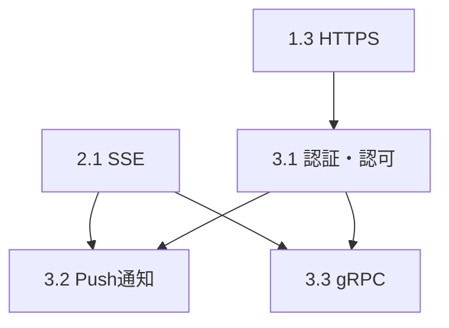

# Phase 3 設計書: エンタープライズ機能

**バージョン**: 1.0
**作成日**: 2025-12-29
**ステータス**: Draft
**前提条件**: Phase 1, Phase 2 完了

---

## 目次

1. [概要](#1-概要)
2. [3.1 認証・認可](#31-認証認可)
3. [3.2 Push通知](#32-push通知)
4. [3.3 gRPC対応](#33-grpc対応)
5. [セキュリティ考慮事項](#セキュリティ考慮事項)
6. [運用設計](#運用設計)

---

## 1. 概要

### 1.1 Phase 3 の目標

Phase 3 では、エンタープライズ環境での利用を想定した高度な機能を実装する。

| 機能 | 目的 | 複雑度 |
|------|------|--------|
| 認証・認可 | セキュアなアクセス制御 | 非常に高 |
| Push通知 | サーバー発のイベント配信 | 高 |
| gRPC対応 | 高性能な双方向通信 | 非常に高 |

### 1.2 対象ユースケース

```
┌─────────────────────────────────────────────────────────────┐
│                     Enterprise Deployment                    │
├─────────────────────────────────────────────────────────────┤
│                                                              │
│  ┌──────────────┐    ┌──────────────┐    ┌──────────────┐  │
│  │   Team A     │    │   Team B     │    │   Team C     │  │
│  │  Agents      │    │  Agents      │    │  Agents      │  │
│  └──────┬───────┘    └──────┬───────┘    └──────┬───────┘  │
│         │                   │                   │           │
│         └───────────────────┼───────────────────┘           │
│                             │                               │
│                    ┌────────▼────────┐                      │
│                    │  Synapse Hub    │                      │
│                    │  (認証/ルーティング)                    │
│                    └────────┬────────┘                      │
│                             │                               │
│              ┌──────────────┼──────────────┐                │
│              │              │              │                │
│         ┌────▼────┐   ┌─────▼─────┐  ┌────▼────┐           │
│         │ API GW  │   │ Push Svc  │  │  gRPC   │           │
│         │ (REST)  │   │ (WebPush) │  │ Gateway │           │
│         └─────────┘   └───────────┘  └─────────┘           │
│                                                              │
└─────────────────────────────────────────────────────────────┘
```

### 1.3 Phase 2 からの依存関係



---

## 3.1 認証・認可

### 目的

A2Aエンドポイントへのアクセスを認証し、エージェント間の通信権限を制御する。

### 認証方式

| 方式 | ユースケース | 複雑度 |
|------|-------------|--------|
| API Key | シンプルな認証 | 低 |
| JWT | ステートレス認証 | 中 |
| mTLS | 最高セキュリティ | 高 |
| OAuth 2.0 | 外部ID連携 | 高 |

### アーキテクチャ

```
┌─────────────────────────────────────────────────────────────────┐
│                      Authentication Layer                        │
├─────────────────────────────────────────────────────────────────┤
│                                                                  │
│  ┌──────────────┐                                               │
│  │   Request    │                                               │
│  └──────┬───────┘                                               │
│         │                                                        │
│         ▼                                                        │
│  ┌──────────────┐    ┌──────────────┐    ┌──────────────────┐  │
│  │ API Key      │───▶│   JWT        │───▶│   mTLS           │  │
│  │ Validator    │    │  Validator   │    │   Validator      │  │
│  └──────────────┘    └──────────────┘    └──────────────────┘  │
│         │                   │                    │              │
│         └───────────────────┼────────────────────┘              │
│                             ▼                                    │
│                    ┌────────────────┐                           │
│                    │  AuthContext   │                           │
│                    │  (identity,    │                           │
│                    │   permissions) │                           │
│                    └────────────────┘                           │
│                             │                                    │
│                             ▼                                    │
│                    ┌────────────────┐                           │
│                    │ Authorization  │                           │
│                    │ (RBAC/ABAC)    │                           │
│                    └────────────────┘                           │
│                                                                  │
└─────────────────────────────────────────────────────────────────┘
```

### 認証コンテキスト

```python
# synapse/auth/context.py

from dataclasses import dataclass, field
from typing import List, Optional, Set
from enum import Enum
from datetime import datetime


class Permission(Enum):
    """エージェント権限"""
    SEND_MESSAGE = "send_message"
    RECEIVE_MESSAGE = "receive_message"
    SEND_PRIORITY = "send_priority"      # Priority 5 送信
    CANCEL_TASK = "cancel_task"
    VIEW_STATUS = "view_status"
    MANAGE_AGENTS = "manage_agents"       # 管理者権限


class Role(Enum):
    """定義済みロール"""
    AGENT = "agent"           # 基本的なエージェント
    SUPERVISOR = "supervisor"  # 優先度送信可能
    ADMIN = "admin"           # 全権限


ROLE_PERMISSIONS = {
    Role.AGENT: {
        Permission.SEND_MESSAGE,
        Permission.RECEIVE_MESSAGE,
        Permission.VIEW_STATUS,
    },
    Role.SUPERVISOR: {
        Permission.SEND_MESSAGE,
        Permission.RECEIVE_MESSAGE,
        Permission.SEND_PRIORITY,
        Permission.CANCEL_TASK,
        Permission.VIEW_STATUS,
    },
    Role.ADMIN: set(Permission),  # 全権限
}


@dataclass
class AuthContext:
    """認証コンテキスト"""
    agent_id: str                           # 認証されたエージェントID
    roles: Set[Role] = field(default_factory=set)
    permissions: Set[Permission] = field(default_factory=set)
    issued_at: datetime = field(default_factory=datetime.utcnow)
    expires_at: Optional[datetime] = None
    metadata: dict = field(default_factory=dict)

    def __post_init__(self):
        # ロールから権限を展開
        for role in self.roles:
            self.permissions.update(ROLE_PERMISSIONS.get(role, set()))

    def has_permission(self, permission: Permission) -> bool:
        """権限を持っているか確認"""
        return permission in self.permissions

    def can_send_to(self, target_agent_id: str) -> bool:
        """指定エージェントへ送信可能か"""
        if self.has_permission(Permission.MANAGE_AGENTS):
            return True
        # TODO: ACL ベースの制御を追加
        return self.has_permission(Permission.SEND_MESSAGE)

    def is_expired(self) -> bool:
        """期限切れか確認"""
        if self.expires_at is None:
            return False
        return datetime.utcnow() > self.expires_at
```

### API Key 認証

```python
# synapse/auth/api_key.py

import hashlib
import secrets
from pathlib import Path
from typing import Optional
import json
import logging

logger = logging.getLogger(__name__)


class APIKeyManager:
    """API キー管理"""

    KEY_FILE = Path.home() / ".a2a" / "api_keys.json"

    def __init__(self):
        self._keys: dict = {}
        self._load_keys()

    def _load_keys(self):
        """キーをファイルから読み込み"""
        if self.KEY_FILE.exists():
            with open(self.KEY_FILE) as f:
                self._keys = json.load(f)

    def _save_keys(self):
        """キーをファイルに保存"""
        self.KEY_FILE.parent.mkdir(parents=True, exist_ok=True)
        with open(self.KEY_FILE, 'w') as f:
            json.dump(self._keys, f, indent=2)

    def generate_key(
        self,
        agent_id: str,
        roles: List[str] = None
    ) -> str:
        """新しいAPIキーを生成"""
        # 32バイトのランダムキー
        raw_key = secrets.token_urlsafe(32)

        # ハッシュ化して保存
        key_hash = hashlib.sha256(raw_key.encode()).hexdigest()

        self._keys[key_hash] = {
            "agent_id": agent_id,
            "roles": roles or ["agent"],
            "created_at": datetime.utcnow().isoformat()
        }
        self._save_keys()

        return raw_key

    def validate_key(self, api_key: str) -> Optional[AuthContext]:
        """APIキーを検証してAuthContextを返す"""
        key_hash = hashlib.sha256(api_key.encode()).hexdigest()

        if key_hash not in self._keys:
            return None

        key_data = self._keys[key_hash]
        roles = {Role(r) for r in key_data.get("roles", ["agent"])}

        return AuthContext(
            agent_id=key_data["agent_id"],
            roles=roles
        )

    def revoke_key(self, api_key: str) -> bool:
        """APIキーを無効化"""
        key_hash = hashlib.sha256(api_key.encode()).hexdigest()
        if key_hash in self._keys:
            del self._keys[key_hash]
            self._save_keys()
            return True
        return False
```

### JWT 認証

```python
# synapse/auth/jwt_auth.py

from datetime import datetime, timedelta
from typing import Optional
import jwt
import logging

logger = logging.getLogger(__name__)


class JWTConfig:
    """JWT設定"""
    SECRET_KEY: str = ""  # 環境変数から取得すべき
    ALGORITHM: str = "HS256"
    ACCESS_TOKEN_EXPIRE_MINUTES: int = 60
    ISSUER: str = "synapse-a2a"


class JWTManager:
    """JWT管理"""

    def __init__(self, config: JWTConfig):
        self.config = config
        if not config.SECRET_KEY:
            raise ValueError("JWT SECRET_KEY must be set")

    def create_token(
        self,
        agent_id: str,
        roles: List[str],
        expires_delta: Optional[timedelta] = None
    ) -> str:
        """JWTトークンを生成"""
        if expires_delta is None:
            expires_delta = timedelta(
                minutes=self.config.ACCESS_TOKEN_EXPIRE_MINUTES
            )

        expire = datetime.utcnow() + expires_delta

        payload = {
            "sub": agent_id,
            "roles": roles,
            "iss": self.config.ISSUER,
            "iat": datetime.utcnow(),
            "exp": expire
        }

        return jwt.encode(
            payload,
            self.config.SECRET_KEY,
            algorithm=self.config.ALGORITHM
        )

    def validate_token(self, token: str) -> Optional[AuthContext]:
        """トークンを検証してAuthContextを返す"""
        try:
            payload = jwt.decode(
                token,
                self.config.SECRET_KEY,
                algorithms=[self.config.ALGORITHM],
                issuer=self.config.ISSUER
            )

            roles = {Role(r) for r in payload.get("roles", ["agent"])}

            return AuthContext(
                agent_id=payload["sub"],
                roles=roles,
                issued_at=datetime.fromtimestamp(payload["iat"]),
                expires_at=datetime.fromtimestamp(payload["exp"])
            )

        except jwt.ExpiredSignatureError:
            logger.warning("JWT token expired")
            return None
        except jwt.InvalidTokenError as e:
            logger.warning(f"Invalid JWT token: {e}")
            return None
```

### mTLS 認証

```python
# synapse/auth/mtls.py

from pathlib import Path
from typing import Optional
import ssl
from cryptography import x509
from cryptography.hazmat.backends import default_backend
import logging

logger = logging.getLogger(__name__)


class MTLSConfig:
    """mTLS設定"""
    ca_cert: Path          # CA証明書
    server_cert: Path      # サーバー証明書
    server_key: Path       # サーバー秘密鍵
    verify_client: bool = True


class MTLSManager:
    """mTLS管理"""

    def __init__(self, config: MTLSConfig):
        self.config = config

    def create_ssl_context(self) -> ssl.SSLContext:
        """サーバー用SSLコンテキストを作成"""
        context = ssl.create_default_context(ssl.Purpose.CLIENT_AUTH)

        # サーバー証明書をロード
        context.load_cert_chain(
            certfile=str(self.config.server_cert),
            keyfile=str(self.config.server_key)
        )

        if self.config.verify_client:
            # クライアント証明書を要求
            context.verify_mode = ssl.CERT_REQUIRED
            context.load_verify_locations(
                cafile=str(self.config.ca_cert)
            )

        return context

    def extract_client_identity(
        self,
        client_cert_pem: bytes
    ) -> Optional[AuthContext]:
        """クライアント証明書からIDを抽出"""
        try:
            cert = x509.load_pem_x509_certificate(
                client_cert_pem,
                default_backend()
            )

            # Common Name をエージェントIDとして使用
            cn = cert.subject.get_attributes_for_oid(
                x509.oid.NameOID.COMMON_NAME
            )[0].value

            # 組織単位をロールとして使用
            ou_attrs = cert.subject.get_attributes_for_oid(
                x509.oid.NameOID.ORGANIZATIONAL_UNIT_NAME
            )
            roles = {Role(attr.value) for attr in ou_attrs if attr.value}

            return AuthContext(
                agent_id=cn,
                roles=roles or {Role.AGENT},
                metadata={"cert_serial": str(cert.serial_number)}
            )

        except Exception as e:
            logger.error(f"Failed to extract client identity: {e}")
            return None
```

### FastAPI 認証ミドルウェア

```python
# synapse/auth/middleware.py

from fastapi import Request, HTTPException, Depends
from fastapi.security import APIKeyHeader, HTTPBearer
from typing import Optional
import logging

logger = logging.getLogger(__name__)

api_key_header = APIKeyHeader(name="X-API-Key", auto_error=False)
bearer_token = HTTPBearer(auto_error=False)


class AuthMiddleware:
    """認証ミドルウェア"""

    def __init__(
        self,
        api_key_manager: Optional[APIKeyManager] = None,
        jwt_manager: Optional[JWTManager] = None,
        mtls_manager: Optional[MTLSManager] = None,
        required: bool = True
    ):
        self.api_key_manager = api_key_manager
        self.jwt_manager = jwt_manager
        self.mtls_manager = mtls_manager
        self.required = required

    async def __call__(
        self,
        request: Request,
        api_key: Optional[str] = Depends(api_key_header),
        bearer: Optional[HTTPBearer] = Depends(bearer_token)
    ) -> AuthContext:
        """リクエストを認証"""
        auth_context = None

        # 1. API Key をチェック
        if api_key and self.api_key_manager:
            auth_context = self.api_key_manager.validate_key(api_key)

        # 2. JWT をチェック
        if not auth_context and bearer and self.jwt_manager:
            auth_context = self.jwt_manager.validate_token(
                bearer.credentials
            )

        # 3. mTLS をチェック（クライアント証明書から）
        if not auth_context and self.mtls_manager:
            client_cert = request.scope.get("client_cert")
            if client_cert:
                auth_context = self.mtls_manager.extract_client_identity(
                    client_cert
                )

        # 認証必須だが認証されていない
        if self.required and not auth_context:
            raise HTTPException(
                status_code=401,
                detail="Authentication required",
                headers={"WWW-Authenticate": "Bearer, ApiKey"}
            )

        # 期限切れチェック
        if auth_context and auth_context.is_expired():
            raise HTTPException(
                status_code=401,
                detail="Token expired"
            )

        return auth_context


def require_permission(permission: Permission):
    """権限を要求するデコレータ"""
    async def dependency(
        auth: AuthContext = Depends(auth_middleware)
    ):
        if not auth.has_permission(permission):
            raise HTTPException(
                status_code=403,
                detail=f"Permission denied: {permission.value}"
            )
        return auth
    return dependency


# グローバルインスタンス
auth_middleware = AuthMiddleware(required=False)  # デフォルトは任意
```

### サーバーへの統合

```python
# synapse/server.py への追加

from synapse.auth.middleware import (
    auth_middleware, require_permission, Permission
)


@app.post("/tasks/send")
async def send_task(
    request: TaskSendRequest,
    auth: AuthContext = Depends(auth_middleware)
):
    """メッセージ送信（認証あり）"""
    if auth and not auth.can_send_to(request.target_agent):
        raise HTTPException(403, "Not authorized to send to this agent")

    # ... 既存の処理 ...


@app.post("/tasks/send-priority")
async def send_priority(
    request: TaskSendRequest,
    auth: AuthContext = Depends(
        require_permission(Permission.SEND_PRIORITY)
    )
):
    """優先度付きメッセージ送信（SUPERVISOR以上）"""
    # ... 処理 ...


@app.delete("/agents/{agent_id}")
async def remove_agent(
    agent_id: str,
    auth: AuthContext = Depends(
        require_permission(Permission.MANAGE_AGENTS)
    )
):
    """エージェント削除（ADMIN権限必要）"""
    # ... 処理 ...
```

### テスト計画

```python
# tests/test_auth.py

class TestAPIKeyAuth:
    def test_generates_valid_key(self):
        """有効なキーを生成できる"""
        manager = APIKeyManager()
        key = manager.generate_key("test-agent")
        assert len(key) > 32

    def test_validates_key(self):
        """キーを検証できる"""
        manager = APIKeyManager()
        key = manager.generate_key("test-agent", roles=["supervisor"])
        auth = manager.validate_key(key)
        assert auth is not None
        assert auth.agent_id == "test-agent"

    def test_invalid_key_returns_none(self):
        """無効なキーはNoneを返す"""
        manager = APIKeyManager()
        auth = manager.validate_key("invalid-key")
        assert auth is None


class TestJWTAuth:
    def test_creates_valid_token(self):
        """有効なトークンを生成できる"""
        config = JWTConfig(SECRET_KEY="test-secret")
        manager = JWTManager(config)
        token = manager.create_token("test-agent", ["agent"])
        assert token is not None

    def test_validates_token(self):
        """トークンを検証できる"""
        config = JWTConfig(SECRET_KEY="test-secret")
        manager = JWTManager(config)
        token = manager.create_token("test-agent", ["supervisor"])
        auth = manager.validate_token(token)
        assert auth.agent_id == "test-agent"
        assert Role.SUPERVISOR in auth.roles


class TestAuthContext:
    def test_role_permissions_expanded(self):
        """ロールから権限が展開される"""
        auth = AuthContext(
            agent_id="test",
            roles={Role.SUPERVISOR}
        )
        assert auth.has_permission(Permission.SEND_PRIORITY)
        assert not auth.has_permission(Permission.MANAGE_AGENTS)
```

---

## 3.2 Push通知

### 目的

サーバーからクライアントへ能動的にイベントを配信する。タスクの状態変化やエージェント間のメッセージをリアルタイムで通知。

### 通知方式

| 方式 | 特徴 | ユースケース |
|------|------|-------------|
| WebPush | ブラウザ標準 | Webクライアント |
| WebSocket | 低レイテンシ | リアルタイムUI |
| Webhook | シンプル | サーバー間連携 |

### アーキテクチャ

```
┌─────────────────────────────────────────────────────────────────┐
│                        Push Service                              │
├─────────────────────────────────────────────────────────────────┤
│                                                                  │
│  ┌──────────────┐    ┌──────────────┐    ┌──────────────────┐  │
│  │   Events     │───▶│ Dispatcher   │───▶│  Subscribers     │  │
│  │   Queue      │    │              │    │  Registry        │  │
│  └──────────────┘    └──────────────┘    └──────────────────┘  │
│                             │                                    │
│              ┌──────────────┼──────────────┐                    │
│              ▼              ▼              ▼                    │
│       ┌──────────┐   ┌──────────┐   ┌──────────┐               │
│       │ WebPush  │   │WebSocket │   │ Webhook  │               │
│       │ Adapter  │   │ Adapter  │   │ Adapter  │               │
│       └──────────┘   └──────────┘   └──────────┘               │
│              │              │              │                    │
└──────────────│──────────────│──────────────│────────────────────┘
               ▼              ▼              ▼
         ┌──────────┐  ┌──────────┐  ┌──────────┐
         │ Browser  │  │ Client   │  │ External │
         │          │  │          │  │ Service  │
         └──────────┘  └──────────┘  └──────────┘
```

### 通知イベント定義

```python
# synapse/push/events.py

from dataclasses import dataclass, field
from typing import Optional, List, Any
from enum import Enum
from datetime import datetime
import uuid


class EventType(Enum):
    """イベント種別"""
    TASK_STATUS_CHANGED = "task.status_changed"
    TASK_ARTIFACT_ADDED = "task.artifact_added"
    MESSAGE_RECEIVED = "message.received"
    AGENT_ONLINE = "agent.online"
    AGENT_OFFLINE = "agent.offline"
    PRIORITY_INTERRUPT = "priority.interrupt"


@dataclass
class PushEvent:
    """プッシュ通知イベント"""
    event_type: EventType
    payload: dict
    target_agents: List[str] = field(default_factory=list)  # 空=全員
    source_agent: Optional[str] = None
    event_id: str = field(default_factory=lambda: str(uuid.uuid4()))
    timestamp: datetime = field(default_factory=datetime.utcnow)
    priority: int = 1  # 1-5

    def to_dict(self) -> dict:
        """辞書に変換"""
        return {
            "id": self.event_id,
            "type": self.event_type.value,
            "payload": self.payload,
            "source": self.source_agent,
            "timestamp": self.timestamp.isoformat() + "Z",
            "priority": self.priority
        }
```

### サブスクライバー管理

```python
# synapse/push/subscribers.py

from dataclasses import dataclass
from typing import Dict, Set, Optional, Callable
from enum import Enum
import asyncio
import logging

logger = logging.getLogger(__name__)


class TransportType(Enum):
    """通知トランスポート"""
    WEBPUSH = "webpush"
    WEBSOCKET = "websocket"
    WEBHOOK = "webhook"


@dataclass
class Subscriber:
    """サブスクライバー情報"""
    agent_id: str
    transport: TransportType
    endpoint: str  # WebPush endpoint / WebSocket conn / Webhook URL
    subscribed_events: Set[EventType]
    metadata: dict = None

    def __hash__(self):
        return hash((self.agent_id, self.transport, self.endpoint))


class SubscriberRegistry:
    """サブスクライバー管理"""

    def __init__(self):
        self._subscribers: Dict[str, Set[Subscriber]] = {}  # agent_id -> subs
        self._by_event: Dict[EventType, Set[Subscriber]] = {}  # event -> subs
        self._lock = asyncio.Lock()

    async def subscribe(
        self,
        agent_id: str,
        transport: TransportType,
        endpoint: str,
        events: Set[EventType]
    ) -> Subscriber:
        """サブスクライブ登録"""
        async with self._lock:
            sub = Subscriber(
                agent_id=agent_id,
                transport=transport,
                endpoint=endpoint,
                subscribed_events=events
            )

            # エージェント別インデックス
            if agent_id not in self._subscribers:
                self._subscribers[agent_id] = set()
            self._subscribers[agent_id].add(sub)

            # イベント別インデックス
            for event in events:
                if event not in self._by_event:
                    self._by_event[event] = set()
                self._by_event[event].add(sub)

            logger.info(f"Subscriber registered: {agent_id} via {transport}")
            return sub

    async def unsubscribe(self, subscriber: Subscriber):
        """サブスクライブ解除"""
        async with self._lock:
            agent_id = subscriber.agent_id

            if agent_id in self._subscribers:
                self._subscribers[agent_id].discard(subscriber)

            for event in subscriber.subscribed_events:
                if event in self._by_event:
                    self._by_event[event].discard(subscriber)

            logger.info(f"Subscriber removed: {agent_id}")

    async def get_subscribers_for_event(
        self,
        event: PushEvent
    ) -> Set[Subscriber]:
        """イベントの対象サブスクライバーを取得"""
        async with self._lock:
            subscribers = set()

            # イベントタイプでフィルタ
            event_subs = self._by_event.get(event.event_type, set())

            for sub in event_subs:
                # 対象エージェント指定がある場合はフィルタ
                if event.target_agents:
                    if sub.agent_id in event.target_agents:
                        subscribers.add(sub)
                else:
                    subscribers.add(sub)

            return subscribers
```

### イベントディスパッチャー

```python
# synapse/push/dispatcher.py

import asyncio
from typing import Dict, Callable, Awaitable
import logging

logger = logging.getLogger(__name__)


class EventDispatcher:
    """イベントディスパッチャー"""

    def __init__(self, subscriber_registry: SubscriberRegistry):
        self.registry = subscriber_registry
        self._adapters: Dict[TransportType, 'PushAdapter'] = {}
        self._queue: asyncio.Queue = asyncio.Queue()
        self._running = False

    def register_adapter(
        self,
        transport: TransportType,
        adapter: 'PushAdapter'
    ):
        """トランスポートアダプターを登録"""
        self._adapters[transport] = adapter

    async def dispatch(self, event: PushEvent):
        """イベントをキューに追加"""
        await self._queue.put(event)

    async def start(self):
        """ディスパッチャーを開始"""
        self._running = True
        asyncio.create_task(self._dispatch_loop())

    async def stop(self):
        """ディスパッチャーを停止"""
        self._running = False

    async def _dispatch_loop(self):
        """イベント配信ループ"""
        while self._running:
            try:
                event = await asyncio.wait_for(
                    self._queue.get(),
                    timeout=1.0
                )

                subscribers = await self.registry.get_subscribers_for_event(
                    event
                )

                # 並列で配信
                tasks = []
                for sub in subscribers:
                    adapter = self._adapters.get(sub.transport)
                    if adapter:
                        tasks.append(
                            adapter.send(sub, event)
                        )

                if tasks:
                    results = await asyncio.gather(
                        *tasks,
                        return_exceptions=True
                    )
                    for i, result in enumerate(results):
                        if isinstance(result, Exception):
                            logger.error(
                                f"Push delivery failed: {result}"
                            )

            except asyncio.TimeoutError:
                continue
            except Exception as e:
                logger.exception(f"Dispatcher error: {e}")
```

### WebSocket アダプター

```python
# synapse/push/adapters/websocket.py

from fastapi import WebSocket
from typing import Dict, Set
import asyncio
import json
import logging

logger = logging.getLogger(__name__)


class WebSocketAdapter:
    """WebSocket通知アダプター"""

    def __init__(self):
        self._connections: Dict[str, Set[WebSocket]] = {}  # endpoint -> ws

    async def connect(
        self,
        websocket: WebSocket,
        agent_id: str
    ):
        """WebSocket接続を登録"""
        await websocket.accept()

        endpoint = str(id(websocket))
        if endpoint not in self._connections:
            self._connections[endpoint] = set()
        self._connections[endpoint].add(websocket)

        logger.info(f"WebSocket connected: {agent_id}")

    async def disconnect(self, websocket: WebSocket):
        """WebSocket接続を解除"""
        endpoint = str(id(websocket))
        if endpoint in self._connections:
            self._connections[endpoint].discard(websocket)
            if not self._connections[endpoint]:
                del self._connections[endpoint]

    async def send(self, subscriber: Subscriber, event: PushEvent):
        """イベントを送信"""
        endpoint = subscriber.endpoint
        if endpoint not in self._connections:
            logger.warning(f"No WebSocket connection for {endpoint}")
            return

        message = json.dumps(event.to_dict())
        dead_connections = []

        for ws in self._connections[endpoint]:
            try:
                await ws.send_text(message)
            except Exception as e:
                logger.error(f"WebSocket send error: {e}")
                dead_connections.append(ws)

        # 死んだ接続を削除
        for ws in dead_connections:
            self._connections[endpoint].discard(ws)
```

### Webhook アダプター

```python
# synapse/push/adapters/webhook.py

import httpx
from typing import Optional
import logging

logger = logging.getLogger(__name__)


class WebhookAdapter:
    """Webhook通知アダプター"""

    def __init__(
        self,
        timeout: float = 10.0,
        retry_count: int = 3
    ):
        self.timeout = timeout
        self.retry_count = retry_count

    async def send(
        self,
        subscriber: Subscriber,
        event: PushEvent
    ):
        """Webhookを送信"""
        url = subscriber.endpoint
        payload = event.to_dict()

        async with httpx.AsyncClient() as client:
            for attempt in range(self.retry_count):
                try:
                    response = await client.post(
                        url,
                        json=payload,
                        timeout=self.timeout,
                        headers={
                            "Content-Type": "application/json",
                            "X-Synapse-Event": event.event_type.value,
                            "X-Synapse-Event-ID": event.event_id
                        }
                    )

                    if response.status_code == 200:
                        logger.debug(f"Webhook delivered: {url}")
                        return
                    else:
                        logger.warning(
                            f"Webhook returned {response.status_code}: {url}"
                        )

                except Exception as e:
                    logger.error(
                        f"Webhook attempt {attempt + 1} failed: {e}"
                    )

                # リトライ待機
                if attempt < self.retry_count - 1:
                    await asyncio.sleep(2 ** attempt)

            logger.error(f"Webhook delivery failed after retries: {url}")
```

### サーバーへの統合

```python
# synapse/server.py への追加

from fastapi import WebSocket
from synapse.push.dispatcher import EventDispatcher
from synapse.push.subscribers import SubscriberRegistry, TransportType
from synapse.push.adapters.websocket import WebSocketAdapter
from synapse.push.adapters.webhook import WebhookAdapter

# 初期化
subscriber_registry = SubscriberRegistry()
dispatcher = EventDispatcher(subscriber_registry)
ws_adapter = WebSocketAdapter()

dispatcher.register_adapter(TransportType.WEBSOCKET, ws_adapter)
dispatcher.register_adapter(TransportType.WEBHOOK, WebhookAdapter())


@app.on_event("startup")
async def startup():
    await dispatcher.start()


@app.websocket("/ws/{agent_id}")
async def websocket_endpoint(websocket: WebSocket, agent_id: str):
    """WebSocket接続エンドポイント"""
    await ws_adapter.connect(websocket, agent_id)

    # サブスクライブ登録
    endpoint = str(id(websocket))
    await subscriber_registry.subscribe(
        agent_id=agent_id,
        transport=TransportType.WEBSOCKET,
        endpoint=endpoint,
        events=set(EventType)  # 全イベント
    )

    try:
        while True:
            # クライアントからのメッセージを待機
            data = await websocket.receive_text()
            # TODO: クライアントからのコマンド処理
    except Exception:
        pass
    finally:
        await ws_adapter.disconnect(websocket)


@app.post("/push/subscribe")
async def subscribe_push(
    request: PushSubscribeRequest,
    auth: AuthContext = Depends(auth_middleware)
):
    """Push通知をサブスクライブ"""
    transport = TransportType(request.transport)
    events = {EventType(e) for e in request.events}

    subscriber = await subscriber_registry.subscribe(
        agent_id=auth.agent_id,
        transport=transport,
        endpoint=request.endpoint,
        events=events
    )

    return {"status": "subscribed", "subscriber_id": str(id(subscriber))}
```

### テスト計画

```python
# tests/test_push.py

class TestEventDispatcher:
    @pytest.mark.asyncio
    async def test_dispatches_to_subscribers(self):
        """サブスクライバーにディスパッチされる"""
        registry = SubscriberRegistry()
        dispatcher = EventDispatcher(registry)

        received = []
        mock_adapter = MockAdapter(on_send=lambda s, e: received.append(e))
        dispatcher.register_adapter(TransportType.WEBHOOK, mock_adapter)

        await registry.subscribe(
            "agent-1", TransportType.WEBHOOK,
            "http://example.com/hook",
            {EventType.TASK_STATUS_CHANGED}
        )

        await dispatcher.start()
        await dispatcher.dispatch(PushEvent(
            event_type=EventType.TASK_STATUS_CHANGED,
            payload={"task_id": "123"}
        ))

        await asyncio.sleep(0.1)
        assert len(received) == 1


class TestWebSocketAdapter:
    @pytest.mark.asyncio
    async def test_broadcasts_to_connections(self):
        """接続にブロードキャストされる"""
        adapter = WebSocketAdapter()
        # ... モックWebSocketでテスト
```

---

## 3.3 gRPC対応

### 目的

HTTPよりも高性能な双方向ストリーミング通信を提供。大量のエージェント間通信に対応。

### なぜ gRPC か

| 特性 | REST/HTTP | gRPC |
|------|-----------|------|
| プロトコル | HTTP/1.1 or 2 | HTTP/2 |
| データ形式 | JSON | Protocol Buffers |
| ストリーミング | 単方向（SSE） | 双方向 |
| パフォーマンス | 良 | 優 |
| 型安全性 | なし | あり |

### Protocol Buffers 定義

```protobuf
// synapse/proto/a2a.proto

syntax = "proto3";

package synapse.a2a;

option go_package = "github.com/synapse/a2a/proto";

// サービス定義
service A2AService {
    // 単一メッセージ送信
    rpc SendMessage(SendMessageRequest) returns (SendMessageResponse);

    // 双方向ストリーミング
    rpc StreamMessages(stream Message) returns (stream Message);

    // タスク状態購読
    rpc SubscribeTaskStatus(TaskSubscribeRequest)
        returns (stream TaskStatusEvent);

    // エージェント発見
    rpc DiscoverAgents(DiscoverRequest) returns (DiscoverResponse);
}

// メッセージ定義
message Message {
    string message_id = 1;
    string from_agent = 2;
    string to_agent = 3;
    oneof content {
        TextContent text = 4;
        FileContent file = 5;
        DataContent data = 6;
    }
    int32 priority = 7;
    google.protobuf.Timestamp timestamp = 8;
}

message TextContent {
    string text = 1;
}

message FileContent {
    string name = 1;
    string mime_type = 2;
    bytes data = 3;
}

message DataContent {
    string format = 1;  // json, xml, etc.
    bytes data = 2;
}

message SendMessageRequest {
    Message message = 1;
    bool wait_for_response = 2;
    int32 timeout_ms = 3;
}

message SendMessageResponse {
    string task_id = 1;
    TaskState state = 2;
    repeated Artifact artifacts = 3;
    Error error = 4;
}

enum TaskState {
    TASK_STATE_UNSPECIFIED = 0;
    SUBMITTED = 1;
    WORKING = 2;
    COMPLETED = 3;
    FAILED = 4;
    INPUT_REQUIRED = 5;
    CANCELED = 6;
}

message TaskStatusEvent {
    string task_id = 1;
    TaskState state = 2;
    google.protobuf.Timestamp timestamp = 3;
    oneof payload {
        Artifact artifact = 4;
        Error error = 5;
        InputRequest input_request = 6;
    }
}

message Artifact {
    string name = 1;
    string type = 2;  // text, code, file, data
    repeated Part parts = 3;
    map<string, string> metadata = 4;
}

message Part {
    oneof content {
        string text = 1;
        bytes binary = 2;
    }
}

message Error {
    string code = 1;
    string message = 2;
    map<string, string> data = 3;
}

message InputRequest {
    string prompt = 1;
    string type = 2;  // confirmation, selection, text, password
    repeated string options = 3;
}

message TaskSubscribeRequest {
    string task_id = 1;
}

message DiscoverRequest {
    string filter_type = 1;  // agent type filter
}

message DiscoverResponse {
    repeated AgentCard agents = 1;
}

message AgentCard {
    string agent_id = 1;
    string name = 2;
    string description = 3;
    string endpoint = 4;
    repeated string capabilities = 5;
}
```

### gRPC サーバー実装

```python
# synapse/grpc/server.py

import grpc
from concurrent import futures
from typing import AsyncIterator
import logging

from synapse.proto import a2a_pb2, a2a_pb2_grpc
from synapse.controller import TerminalController
from synapse.a2a_compat import TaskStore
from synapse.auth.context import AuthContext

logger = logging.getLogger(__name__)


class A2AServicer(a2a_pb2_grpc.A2AServiceServicer):
    """gRPC A2A サービス実装"""

    def __init__(
        self,
        controller: TerminalController,
        task_store: TaskStore,
        auth_interceptor: 'AuthInterceptor'
    ):
        self.controller = controller
        self.task_store = task_store
        self.auth = auth_interceptor

    async def SendMessage(
        self,
        request: a2a_pb2.SendMessageRequest,
        context: grpc.aio.ServicerContext
    ) -> a2a_pb2.SendMessageResponse:
        """メッセージ送信"""
        # 認証チェック
        auth_context = await self._get_auth_context(context)
        if not auth_context:
            context.abort(
                grpc.StatusCode.UNAUTHENTICATED,
                "Authentication required"
            )

        message = request.message
        task_id = self.task_store.create_task(message.message_id)

        # CLI に送信
        if message.HasField('text'):
            self.controller.write(message.text.text + "\n")

        # 応答待機
        if request.wait_for_response:
            task = await self._wait_for_task(
                task_id,
                timeout_ms=request.timeout_ms or 30000
            )
            return self._task_to_response(task)

        return a2a_pb2.SendMessageResponse(
            task_id=task_id,
            state=a2a_pb2.SUBMITTED
        )

    async def StreamMessages(
        self,
        request_iterator: AsyncIterator[a2a_pb2.Message],
        context: grpc.aio.ServicerContext
    ) -> AsyncIterator[a2a_pb2.Message]:
        """双方向ストリーミング"""
        auth_context = await self._get_auth_context(context)

        # 出力コールバックを登録
        output_queue = asyncio.Queue()

        def on_output(text: str):
            output_queue.put_nowait(text)

        self.controller.add_output_callback(on_output)

        try:
            # 入力と出力を並行処理
            async def handle_input():
                async for message in request_iterator:
                    if message.HasField('text'):
                        self.controller.write(message.text.text + "\n")

            async def handle_output():
                while True:
                    text = await output_queue.get()
                    yield a2a_pb2.Message(
                        message_id=str(uuid.uuid4()),
                        from_agent=self.controller.agent_id,
                        text=a2a_pb2.TextContent(text=text)
                    )

            # 両方を同時に実行
            await asyncio.gather(
                handle_input(),
                handle_output()
            )

        finally:
            self.controller.remove_output_callback(on_output)

    async def SubscribeTaskStatus(
        self,
        request: a2a_pb2.TaskSubscribeRequest,
        context: grpc.aio.ServicerContext
    ) -> AsyncIterator[a2a_pb2.TaskStatusEvent]:
        """タスク状態購読"""
        task_id = request.task_id

        while not context.cancelled():
            task = self.task_store.get_task(task_id)
            if task:
                yield a2a_pb2.TaskStatusEvent(
                    task_id=task_id,
                    state=self._map_state(task.status.state),
                    timestamp=datetime.utcnow()
                )

                if task.status.state in ('completed', 'failed', 'canceled'):
                    break

            await asyncio.sleep(0.1)

    async def DiscoverAgents(
        self,
        request: a2a_pb2.DiscoverRequest,
        context: grpc.aio.ServicerContext
    ) -> a2a_pb2.DiscoverResponse:
        """エージェント発見"""
        from synapse.registry import AgentRegistry
        registry = AgentRegistry()

        agents = registry.list_agents()
        if request.filter_type:
            agents = [
                a for a in agents
                if a.get('agent_type') == request.filter_type
            ]

        return a2a_pb2.DiscoverResponse(
            agents=[
                a2a_pb2.AgentCard(
                    agent_id=a['agent_id'],
                    name=a.get('name', a['agent_id']),
                    endpoint=a['endpoint']
                )
                for a in agents
            ]
        )

    async def _get_auth_context(
        self,
        context: grpc.aio.ServicerContext
    ) -> Optional[AuthContext]:
        """gRPCメタデータから認証情報を取得"""
        metadata = dict(context.invocation_metadata())
        token = metadata.get('authorization', '')
        if token.startswith('Bearer '):
            return self.auth.validate(token[7:])
        return None

    def _map_state(self, state: str) -> a2a_pb2.TaskState:
        """状態をProtobuf enumにマッピング"""
        mapping = {
            'submitted': a2a_pb2.SUBMITTED,
            'working': a2a_pb2.WORKING,
            'completed': a2a_pb2.COMPLETED,
            'failed': a2a_pb2.FAILED,
            'input_required': a2a_pb2.INPUT_REQUIRED,
            'canceled': a2a_pb2.CANCELED,
        }
        return mapping.get(state, a2a_pb2.TASK_STATE_UNSPECIFIED)


async def serve_grpc(
    port: int = 50051,
    controller: TerminalController = None,
    task_store: TaskStore = None
):
    """gRPCサーバーを起動"""
    server = grpc.aio.server(
        futures.ThreadPoolExecutor(max_workers=10)
    )

    servicer = A2AServicer(controller, task_store, auth_interceptor)
    a2a_pb2_grpc.add_A2AServiceServicer_to_server(servicer, server)

    # TLS設定（本番環境）
    # credentials = grpc.ssl_server_credentials(...)
    # server.add_secure_port(f'[::]:{port}', credentials)

    server.add_insecure_port(f'[::]:{port}')
    await server.start()
    logger.info(f"gRPC server started on port {port}")
    await server.wait_for_termination()
```

### gRPC クライアント

```python
# synapse/grpc/client.py

import grpc
from typing import AsyncIterator, Optional
import logging

from synapse.proto import a2a_pb2, a2a_pb2_grpc

logger = logging.getLogger(__name__)


class A2AGrpcClient:
    """gRPC A2A クライアント"""

    def __init__(
        self,
        target: str,
        credentials: Optional[grpc.ChannelCredentials] = None
    ):
        if credentials:
            self._channel = grpc.aio.secure_channel(target, credentials)
        else:
            self._channel = grpc.aio.insecure_channel(target)

        self._stub = a2a_pb2_grpc.A2AServiceStub(self._channel)

    async def send_message(
        self,
        to_agent: str,
        text: str,
        wait_for_response: bool = False,
        timeout_ms: int = 30000
    ) -> a2a_pb2.SendMessageResponse:
        """メッセージ送信"""
        request = a2a_pb2.SendMessageRequest(
            message=a2a_pb2.Message(
                to_agent=to_agent,
                text=a2a_pb2.TextContent(text=text)
            ),
            wait_for_response=wait_for_response,
            timeout_ms=timeout_ms
        )

        return await self._stub.SendMessage(request)

    async def stream_conversation(
        self,
        to_agent: str
    ) -> tuple[AsyncIterator, AsyncIterator]:
        """双方向ストリーミング会話"""

        async def send_generator():
            """送信メッセージを生成"""
            while True:
                text = yield  # 外部からsend()で受け取る
                if text is None:
                    break
                yield a2a_pb2.Message(
                    to_agent=to_agent,
                    text=a2a_pb2.TextContent(text=text)
                )

        send_gen = send_generator()
        response_stream = self._stub.StreamMessages(send_gen)

        return send_gen, response_stream

    async def subscribe_task(
        self,
        task_id: str
    ) -> AsyncIterator[a2a_pb2.TaskStatusEvent]:
        """タスク状態を購読"""
        request = a2a_pb2.TaskSubscribeRequest(task_id=task_id)
        async for event in self._stub.SubscribeTaskStatus(request):
            yield event

    async def discover_agents(
        self,
        filter_type: str = ""
    ) -> list[a2a_pb2.AgentCard]:
        """エージェントを発見"""
        request = a2a_pb2.DiscoverRequest(filter_type=filter_type)
        response = await self._stub.DiscoverAgents(request)
        return list(response.agents)

    async def close(self):
        """接続を閉じる"""
        await self._channel.close()
```

### CLI への統合

```python
# synapse/cli.py への追加

@click.command()
@click.option('--grpc', is_flag=True, help='Enable gRPC server')
@click.option('--grpc-port', default=50051, help='gRPC port')
def start(profile, grpc, grpc_port, ...):
    """エージェントを起動"""
    # ... 既存の処理 ...

    if grpc:
        # gRPCサーバーを並行起動
        asyncio.create_task(
            serve_grpc(grpc_port, controller, task_store)
        )

    # ... 既存の処理 ...
```

### テスト計画

```python
# tests/test_grpc.py

class TestGrpcService:
    @pytest.mark.asyncio
    async def test_send_message(self, grpc_server):
        """メッセージを送信できる"""
        client = A2AGrpcClient("localhost:50051")
        response = await client.send_message(
            to_agent="gemini",
            text="Hello"
        )
        assert response.state == a2a_pb2.SUBMITTED
        await client.close()

    @pytest.mark.asyncio
    async def test_stream_messages(self, grpc_server):
        """双方向ストリーミングが動作する"""
        client = A2AGrpcClient("localhost:50051")
        send_gen, recv_stream = await client.stream_conversation("gemini")

        # メッセージ送信
        await send_gen.asend("Hello")

        # 応答受信
        response = await recv_stream.__anext__()
        assert response.HasField('text')

        await client.close()

    @pytest.mark.asyncio
    async def test_discover_agents(self, grpc_server):
        """エージェントを発見できる"""
        client = A2AGrpcClient("localhost:50051")
        agents = await client.discover_agents()
        assert len(agents) > 0
        await client.close()
```

---

## セキュリティ考慮事項

### 脅威モデル

```
┌────────────────────────────────────────────────────────────┐
│                     Attack Surface                          │
├────────────────────────────────────────────────────────────┤
│                                                             │
│  1. ネットワーク層                                          │
│     - 中間者攻撃 (MITM) → mTLS で軽減                       │
│     - DoS攻撃 → レート制限で軽減                            │
│                                                             │
│  2. 認証層                                                  │
│     - クレデンシャル漏洩 → ローテーションポリシー           │
│     - トークンリプレイ → 短い有効期限 + ノンス               │
│                                                             │
│  3. 認可層                                                  │
│     - 権限昇格 → 最小権限の原則                             │
│     - 横断的アクセス → ACL/RBAC                              │
│                                                             │
│  4. データ層                                                │
│     - データ漏洩 → 暗号化 (at rest / in transit)           │
│     - インジェクション → 入力検証                           │
│                                                             │
└────────────────────────────────────────────────────────────┘
```

### セキュリティベストプラクティス

```yaml
# 推奨設定
security:
  # TLS/mTLS
  tls:
    enabled: true
    min_version: "TLS1.3"
    cert_rotation_days: 90

  # 認証
  auth:
    required: true
    token_expiry_minutes: 60
    max_failed_attempts: 5
    lockout_duration_minutes: 15

  # レート制限
  rate_limit:
    requests_per_minute: 100
    burst: 20

  # 監査ログ
  audit:
    enabled: true
    log_auth_events: true
    log_message_content: false  # プライバシー保護
```

---

## 運用設計

### モニタリングメトリクス

```python
# synapse/metrics.py

from prometheus_client import Counter, Histogram, Gauge

# リクエストメトリクス
request_count = Counter(
    'synapse_requests_total',
    'Total requests',
    ['method', 'endpoint', 'status']
)

request_latency = Histogram(
    'synapse_request_latency_seconds',
    'Request latency',
    ['method', 'endpoint']
)

# エージェントメトリクス
active_agents = Gauge(
    'synapse_active_agents',
    'Number of active agents',
    ['agent_type']
)

# タスクメトリクス
task_count = Counter(
    'synapse_tasks_total',
    'Total tasks',
    ['state']
)

task_duration = Histogram(
    'synapse_task_duration_seconds',
    'Task duration'
)
```

### ログ設計

```python
# 構造化ログ形式
{
    "timestamp": "2025-12-29T12:00:00Z",
    "level": "INFO",
    "logger": "synapse.auth",
    "message": "Authentication successful",
    "context": {
        "agent_id": "synapse-claude-8100",
        "auth_method": "jwt",
        "remote_ip": "192.168.1.100"
    },
    "trace_id": "abc123"
}
```

### ヘルスチェック

```python
# synapse/server.py への追加

@app.get("/health")
async def health_check():
    """ヘルスチェックエンドポイント"""
    return {
        "status": "healthy",
        "version": __version__,
        "components": {
            "controller": controller.status,
            "task_store": "ok",
            "grpc": "ok" if grpc_enabled else "disabled"
        }
    }

@app.get("/ready")
async def readiness_check():
    """準備状態チェック"""
    if controller.status == "NOT_STARTED":
        raise HTTPException(503, "Not ready")
    return {"status": "ready"}
```

---

## 付録: ファイル構成

```
synapse/
├── auth/
│   ├── __init__.py
│   ├── context.py         # AuthContext, Permission, Role
│   ├── api_key.py         # API Key 認証
│   ├── jwt_auth.py        # JWT 認証
│   ├── mtls.py            # mTLS 認証
│   └── middleware.py      # FastAPI ミドルウェア
├── push/
│   ├── __init__.py
│   ├── events.py          # イベント定義
│   ├── subscribers.py     # サブスクライバー管理
│   ├── dispatcher.py      # ディスパッチャー
│   └── adapters/
│       ├── websocket.py
│       └── webhook.py
├── grpc/
│   ├── __init__.py
│   ├── server.py          # gRPC サーバー
│   └── client.py          # gRPC クライアント
├── proto/
│   ├── a2a.proto          # Protocol Buffers 定義
│   ├── a2a_pb2.py         # 生成されたコード
│   └── a2a_pb2_grpc.py    # 生成されたコード
└── metrics.py             # Prometheus メトリクス
```
