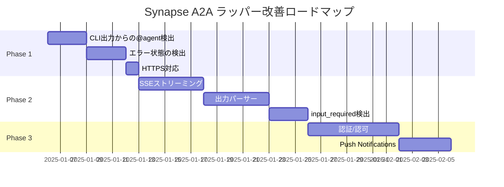

# Synapse A2A ラッパー改善ロードマップ

> **目標**: A2A 非対応の CLI エージェントを A2A エコシステムに参加させる完全なラッパーを実現する

---

## 現状評価

### 完成度サマリー

| カテゴリ | 完成度 | 備考 |
|----------|--------|------|
| A2A プロトコル準拠 | 80% | 必須機能は実装済み |
| ラッパー機能 | 50% | 双方向通信が課題 |
| セキュリティ | 20% | ローカル利用のみ |
| 双方向通信 | 40% | CLI→外部エージェントが弱い |

### アーキテクチャ図

```
┌─────────────────────────────────────────────────────────────┐
│                    Synapse A2A Wrapper                       │
│                                                              │
│  ┌──────────────┐   ┌──────────────┐   ┌──────────────────┐ │
│  │  A2A Server  │   │   PTY Layer  │   │   A2A Client     │ │
│  │  (FastAPI)   │◄─►│ (Controller) │◄─►│ (外部エージェント)│ │
│  └──────┬───────┘   └──────┬───────┘   └──────────────────┘ │
│         │                  │                                 │
│         ▼                  ▼                                 │
│  ┌──────────────────────────────────────────────────────┐   │
│  │              CLI Tool (Claude/Gemini/etc)             │   │
│  │              ※ A2A を認識していない                    │   │
│  └──────────────────────────────────────────────────────┘   │
└─────────────────────────────────────────────────────────────┘
```

---

## Phase 1: 必須改善（ラッパーとして最低限必要）

### 1.1 CLI 出力からの @agent 自動ルーティング ✅ 完了

**状態**: 実装済み

**実装内容**:
- `InputRouter` クラスで `@agent message` パターンを検出
- `controller.py` の `read_callback` と `_monitor_output` で CLI 出力を監視
- `_execute_a2a_action` でA2A送信を実行、フィードバックを表示
- 外部エージェント（ExternalAgentRegistry登録済み）へのルーティングもサポート

**実装箇所**:
- `synapse/input_router.py` - パターン検出とA2A送信ロジック
- `synapse/controller.py` - CLI出力の監視とアクション実行

**テスト**: `tests/test_input_router.py` (26テスト)

---

### 1.2 エラー状態の検出と failed ステータス ✅ 完了

**状態**: 実装済み

**実装内容**:
- `synapse/error_detector.py` - エラーパターン検出モジュール
  - 15種類以上のエラーパターン（command not found, permission denied, rate limit等）
  - AIエージェント拒否パターン（"I cannot", "I'm unable to"等）
  - `input_required` 状態の検出（質問、y/n確認等）
- `Task` モデルに `error` フィールドを追加（A2A準拠）
- `get_task` エンドポイントでエラー検出を実行

**エラーコード例**:
- `COMMAND_NOT_FOUND` - コマンドが見つからない
- `PERMISSION_DENIED` - 権限エラー
- `AGENT_REFUSED` - AIが拒否
- `RATE_LIMITED` - レート制限
- `CLI_ERROR` - 一般的なエラー

**テスト**: `tests/test_error_detector.py` (30テスト)

---

### 1.3 HTTPS 対応 ✅ 完了

**状態**: 実装済み

**実装内容**:
- `synapse start` に `--ssl-cert` と `--ssl-key` オプションを追加
- SSL証明書が指定された場合、uvicornにSSL設定を渡す
- Agent CardのURLが自動的に `https://` に切り替わる

**使い方**:
```bash
# HTTPS で起動
synapse start claude --ssl-cert /path/to/cert.pem --ssl-key /path/to/key.pem

# 自己署名証明書の生成例
openssl req -x509 -newkey rsa:4096 -keyout key.pem -out cert.pem -days 365 -nodes
```

**実装箇所**:
- `synapse/cli.py` - CLIオプション追加、バリデーション
- `synapse/server.py` - uvicorn SSL設定
- `synapse/a2a_compat.py` - Agent Card URL自動切替

---

## Phase 2: 実用性向上

### 2.1 SSE ストリーミング対応 ✅ 完了

**状態**: 実装済み

**実装内容**:
- `/tasks/{id}/subscribe` エンドポイント追加
- Server-Sent Events で CLI 出力をリアルタイムストリーム
- Agent Card に `streaming: true` を追加

**イベントタイプ**:
- `output`: 新しいCLI出力
- `status`: タスクステータス変更
- `done`: タスク完了（最終イベント、artifacts/error含む）

**使い方**:
```bash
# SSEでタスク出力を購読
curl -N "http://localhost:8100/tasks/{task_id}/subscribe"
```

**実装箇所**: `synapse/a2a_compat.py`
**テスト**: `tests/test_a2a_compat.py` (3テスト追加)

---

### 2.2 出力パーサー（構造化 Artifact） ✅ 完了

**状態**: 実装済み

**実装内容**:
- `synapse/output_parser.py` - CLI出力をセグメントに分割
  - `ParsedSegment` データクラス - タイプ、コンテンツ、メタデータ
  - `extract_code_blocks` - Markdownコードブロック抽出
  - `extract_file_references` - ファイル操作（created/modified/deleted）検出
  - `extract_errors` - エラーメッセージ・トレースバック検出
  - `parse_output` - CLI出力を構造化セグメントに変換
  - `segments_to_artifacts` - A2A Artifact形式に変換
- `synapse/a2a_compat.py` - get_taskエンドポイントで自動パース

**セグメントタイプ**:
- `code`: Markdownコードブロック（言語情報付き）
- `file`: ファイル操作（created/modified/deleted/read）
- `error`: エラーメッセージ・トレースバック
- `text`: その他のテキスト

**実装箇所**:
- `synapse/output_parser.py` - パースロジック
- `synapse/a2a_compat.py` - A2A統合

**テスト**: `tests/test_output_parser.py` (38テスト)

---

### 2.3 input_required 状態の検出 ✅ 完了

**状態**: 1.2で実装済み

**実装内容**:
- `synapse/error_detector.py` に `is_input_required()` 関数
- `get_task` エンドポイントで自動検出
- 検出パターン: `?`, `[y/n]`, `Enter X:`, `Please provide` 等

**実装箇所**:
- `synapse/error_detector.py` - パターン検出
- `synapse/a2a_compat.py` - get_task での呼び出し

**テスト**: `tests/test_error_detector.py` の `TestIsInputRequired` クラス

---

## Phase 3: エンタープライズ対応

### 3.1 認証/認可 ✅ 完了

**状態**: 実装済み

**実装内容**:
- `synapse/auth.py` - 認証モジュール
  - API Key認証（ヘッダー `X-API-Key` またはクエリ `api_key`）
  - Admin Key（管理操作用）
  - スコープベースのアクセス制御
  - localhost自動許可（開発用）
- 全タスク関連エンドポイントに認証を追加
- 環境変数での設定:
  - `SYNAPSE_AUTH_ENABLED=true` - 認証を有効化
  - `SYNAPSE_API_KEYS=key1,key2` - 有効なAPIキー
  - `SYNAPSE_ADMIN_KEY=secret` - 管理者キー

**使い方**:
```bash
# 認証を有効にして起動
SYNAPSE_AUTH_ENABLED=true SYNAPSE_API_KEYS=my-secret-key synapse start claude

# APIキーでリクエスト
curl -H "X-API-Key: my-secret-key" http://localhost:8100/tasks
```

**実装箇所**:
- `synapse/auth.py` - 認証ロジック
- `synapse/a2a_compat.py` - エンドポイント保護

**テスト**: `tests/test_auth.py` (34テスト)

---

### 3.2 Push Notifications

**改善内容**:
- Webhook URL 登録
- タスク完了時に POST 通知
- 再試行ロジック

**優先度**: 低
**工数**: 中（3-4日）

---

### 3.3 gRPC 対応

**改善内容**:
- Protocol Buffers 定義
- gRPC サーバー実装
- 高性能通信オプション

**優先度**: 低
**工数**: 高（7-10日）

---

## 実装スケジュール（案）



---

## 完了条件

### Phase 1 完了時 ✅
- [x] CLI が `@agent` を出力したら自動的に A2A 送信される
- [x] エラー時に `failed` ステータスとエラーコードが返る
- [x] HTTPS でサーバーを起動できる

### Phase 2 完了時 ✅
- [x] SSE でリアルタイムに出力を受信できる
- [x] 出力がコード/ファイル/テキストに分類される
- [x] input_required 状態が検出される
- [x] CLI が質問したら `input_required` になる

### Phase 3 完了時
- [x] API Key で認証できる
- [ ] タスク完了時に Webhook 通知される
- [ ] gRPC でも通信できる

---

## 参考資料

- [A2A Protocol Specification](https://a2a-protocol.org/latest/specification/)
- [docs/a2a-design-rationale.md](../../docs/a2a-design-rationale.md)
- [guides/google-a2a-spec.md](../../guides/google-a2a-spec.md)

---

## 更新履歴

| 日付 | 内容 |
|------|------|
| 2025-12-28 | 初版作成 |
| 2025-12-31 | 1.1 CLI出力からの@agent自動ルーティング - 実装済みを確認、テスト修正 |
| 2025-12-31 | 1.2 エラー状態の検出とfailedステータス - 実装完了 |
| 2025-12-31 | 1.3 HTTPS対応 - 実装完了、**Phase 1 完了** |
| 2025-12-31 | 2.1 SSEストリーミング対応 - 実装完了 |
| 2025-12-31 | 2.2 出力パーサー - 実装完了、**Phase 2 完了** |
| 2025-12-31 | 3.1 認証/認可 - API Key認証実装完了 |
